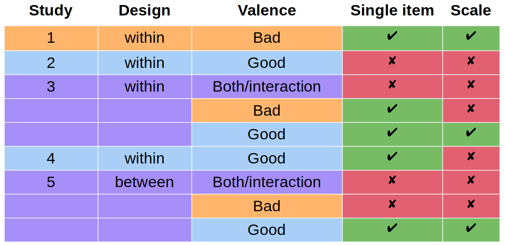
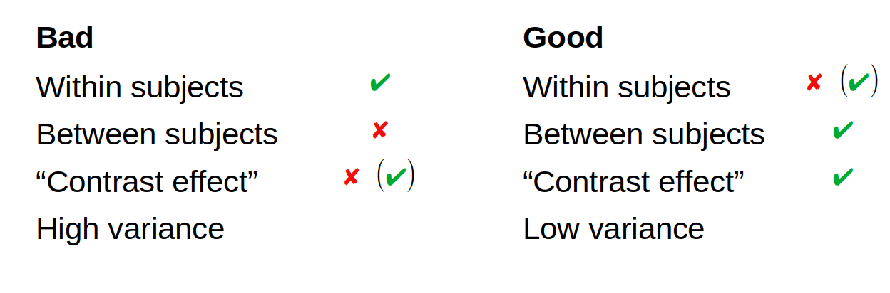

```{r setup, include=FALSE}
knitr::opts_chunk$set(echo = FALSE)
knitr::opts_chunk$set(include = FALSE)
```


```{r load_libraries_cogload}
rm(list = ls())
library(citr)
#install.packages("sjstats")
library(plyr)
library(foreign)
library(car)
library(desnum)
library(ggplot2)
library(extrafont)
#devtools::install_github("crsh/papaja")
library(papaja)
#library("dplyr")
library("afex")
library("tibble")
library(scales)
#install.packages("metap")
library(metap)
library(pwr)
library(lsr)
#install.packages("sjstats")
library(sjstats)
library(DescTools)
#inatall.packages("ggstatsplot")
#library(ggstatsplot)
library(VGAM)
library(nnet)
library(mlogit)
library(reshape2)
#install.packages("powerMediation")
library("powerMediation")
library("ggpubr")


# library(rstatix)


#source("load_all_data.R")

#devtools::install_github("benmarwick/wordcountaddin")
#library(wordcountaddin)
#wordcountaddin::text_stats("cogload_1to5_25Sept19.Rmd")
#setwd("manuscript_prep")
getwd()
```


## Overview

> <div id="footer"> <font size=2>Cillian McHugh - 26/7/22</font size></div>


- Background
- Study 1: bad characters ([results](https://cillianmiltown.github.io/moral_dilution_online/study1_sample_analysis.html))
- Study 2: good characters ([results](https://cillianmiltown.github.io/moral_dilution_online/study4_sample_analysis.html))
- Study 3: both good and bad ([results](https://cillianmiltown.github.io/moral_dilution_online/study5_sample_analysis.html))
- Study 4: good characters ([results](https://cillianmiltown.github.io/moral_dilution_online/study4_rep_sample_analysis.html))
- Study 5: both good and bad (between subjects) ([results](https://cillianmiltown.github.io/moral_dilution_online/study5_sample_analysis.html))
- Overview of results [here](https://cillianmiltown.github.io/moral_dilution_online/update_presentation_scroll.html)

# Background

## The Dilution Effect

> <div id="footer"> <font size=2>Cillian McHugh - 26/7/22</font size></div>

- Diagnostic information about a target is ‘diluted’ by non-diagnostic information about a target (Nisbett, Zukier, & Lemley, 1981; Zukier, 1982; Igou & Bless, 2007; Kemmelmeier, 2007; Tetlock & Boettger, 1989)
- Shown for
  - judging products (Igou & Bless, 2005; Meyvis & Janiszewski, 2002)
  - probability judgments (LaBella & Koehler, 2004)
  - and predictions relating to people’s behavior (Nisbett et al., 1981; Zukier, 1982),

## Examples:

> <div id="footer"> <font size=2>Cillian McHugh - 26/7/22</font size></div>

**Example 1:**

- Task: Predict the GPA of a student (from Zukier, 1982)
  - Diagnostic information: “He quite often starts things he doesn’t finish”
  - Non-diagnostic information: “A few times a year he is bothered by bad dreams”

**Example 2:**

- Task: Predict if a coffee machine would be sold (from Igou & Bless, 2007)
  - Diagnostic information: “It has an automatic off switch”
  - Non-diagnostic information: “It has three buttons”


## Explaining the Dilution Effect

> <div id="footer"> <font size=2>Cillian McHugh - 26/7/22</font size></div>

- Representativeness heuristic and Category Typicality

- In categorization:
  - ***furniture***: *chair* vs *bookend*

- Dilution and typicality
  - **Diagnostic information only**: Very representative (or typical)
  - **Non-Diagnostic information included**:   Very less representative (or less typical)

- One prediction of MJAC is that moral categorizations should vary in typicality
  - Specifically, MJAC "predicts differences in typicality ratings when controlling for severity" (McHugh et al., 2022, p. 143)

## Moral Dilution

> <div id="footer"> <font size=2>Cillian McHugh - 26/7/22</font size></div>

- 5 studies
- Pre-registered
- Dilution effect should be observed for judgments of Moral Character

# Studies


```{r, include=FALSE,echo=FALSE}
df1 <- read.csv("data/study1_data_long.csv")
df3 <- read.csv("data/study1_data_long_clean.csv")

table(df3$gender)
length(df1$gender)/6
length(levels(as.factor(df1$ResponseId)))-length(levels(as.factor(df3$ResponseId)))
length(df3$gender)/4

att_both <- length(levels(as.factor(df1$ResponseId)))-length(levels(as.factor(df3$ResponseId)))

df_long_clean <- df3

x <- df3
x$attn_chk_1Q
x$attn_chk_2_Q
x <- x[which(x$attn_chk_2_Q==2|x$attn_chk_2_Q==5),]
x <- x[which(x$attn_chk_1Q==7),]
df_long_extra_clean <- x

x <- df3
# 
# df3 <- x
# att_both <- length(levels(as.factor(df1$ResponseId)))-length(levels(as.factor(df3$ResponseId)))

```


## Study 1: Bad Characters

> <div id="footer"> <font size=2>Cillian McHugh - 26/7/22</font size></div>


## Study 1: Design

> <div id="footer"> <font size=2>Cillian McHugh - 26/7/22</font size></div>

- Within subjects design
  - IV: Diagnostic information (present/absent)
  - 4 descriptions
  - Randomly assigned to contain diagnostic information vs not


- Imagine a person named Sam. Throughout their life they have been known to be cruel, act unfairly, and to betray their own group.
- Imagine a person named Sam. Throughout their life they have been known to be cruel, act unfairly, and to betray their own group. *They are left-handed, drink tea in the morning, and have two older siblings and one younger sibling.*


## Materials: Moral Descriptions

> <div id="footer"> <font size=2>Cillian McHugh - 26/7/22</font size></div>

- Imagine a person named Sam. Throughout their life they have been known to be cruel, act unfairly, and to betray their own group.

- Imagine a person named Robin. Throughout their life they have been known to physically hurt others, treat some people differently to others, and show lack of loyalty.

- Imagine a person named Francis.
Throughout their life they have been known to violate the standards of purity and decency, show lack of respect for authority, and treat people unequally.

- Imagine a person named Alex.
Throughout their life they have been known to cause others to suffer emotionally, to deny others their rights, and to cause chaos or disorder.


## Materials: Non-Diagnostic

> <div id="footer"> <font size=2>Cillian McHugh - 26/7/22</font size></div>


- They have red hair, play tennis four times a month, and have one older sibling and one younger sibling.

- They are left-handed, drink tea in the morning, and have two older siblings and one younger sibling.


```{r include=FALSE}
## Measures


MPS <- x %>% 
  select(R1,R2,R3,R4)

alpha1 <- ltm::cronbach.alpha(MPS)

alpha1

```

```{r inculde=FALSE}
# length(x$gender)/4
# sum(x$gender=="1")/4
# sum(x$gender=="2")/4
# sum(x$gender=="3")/4
# sum(x$gender=="4")/4
# sum(x$gender=="5")/4
# 
# # 1 = male
# # 2 = female
# # 3 = non-binary
# # 4 = prefer to self describe
# # 5 = prefer not to say
# 
# round(mean(x$age),digits=1)

```


```{r include=FALSE}
## Measures


MPS <- x %>% 
  select(R1,R2,R3,R4)

alpha1 <- ltm::cronbach.alpha(MPS)

alpha1

```

## Study 1: Measures & Participants

> <div id="footer"> <font size=2>Cillian McHugh - 26/7/22</font size></div>

- DV1: MPS-4: Moral perceptions scale (Walker et al., 2021):
  - 7-point Likert
  - 4 items: Bad-Good, Moral-Immoral, Violent-Peaceful, Merciless-Empathetic
  - Cronbach's alpha = `r round(alpha1$alpha, digits=2)`

- DV2: MM-1: Single item of moral perception (Walker et al., 2021).
  - 0-100 slider scale
  - Very Immoral-Very Moral

UL Students with a total sample of *N* = `r length(x$gender)/4`, (female = `r sum(x$gender=="2")/4`, male = `r sum(x$gender=="1")/4`, non-binary/other = `r sum(x$gender=="3")/4 + sum(x$gender=="5")/4`, prefer not to say `r sum(x$gender=="5")/4`, *M~age~* = `r round(mean(x$age),digits=1)`, *SD* = `r round(sd(x$age),digits=1)`).

## Study 1: Results

> <div id="footer"> <font size=2>Cillian McHugh - 26/7/22</font size></div>


```{r}
x <- df3
model0 <- lmerTest::lmer(R_tot ~ 1
                #   condition
                 + (1|ResponseId)
                # + (1|ResponseId:condition)
                , data = x
          #      , contrasts = list(condition = contr.sum  , valence = contr.sum)
            )

summary(model0)
model1 <- lmerTest::lmer(R_tot ~
                  condition*scenario
                + (1|ResponseId)
                + (1|ResponseId:condition)
                , data = x
                , contrasts = list(condition = contr.sum  , scenario = contr.sum)
            )

results_anova <- as.data.frame(anova(model0,model1))
results_anova
results_anova$Chisq[2]
results_anova$Df
p1 <- results_anova$`Pr(>Chisq)`[2]
p_report(p1)
#p_report(results_anova$`Pr(>Chisq)`)[2]
results_anova$AIC
summary_model1 <- summary(model1)
summary_model1
results_coef <- as.data.frame(summary_model1$coefficients)

aov1 <- anova(model1)
f3 <- aov1$`F value`[1]
p3 <- aov1$`Pr(>F)`[1]

results_coef$Estimate[2]
results_coef$`Std. Error`[2]
results_coef$df[2]
t1 <- results_coef$`t value`[2]
p2 <- results_coef$`Pr(>|t|)`[2]

#QuantPsyc::lm.beta(results_coef)
anova(model1)
```

&#9989; Diagnostic descriptions rated as more immoral than the non-diagnostic


**MPS-4**

- The model significantly predicted responses, $\chi$^2^(`r round(results_anova$Df[2],digits=2)`) = `r round(results_anova$Chisq[2],digits=2)`, *p* `r paste(p_report(p1))`.
- Condition significantly influenced responses *F*(`r round(aov1$NumDF[1],digits=2)`, `r round(aov1$DenDF[1],digits=2)`) = `r round(f3,digits=2)`, *p* `r paste(p_report(p3))`
- and was a significant predictor, $b$ = `r round(results_coef$Estimate[2],digits=2)`, *t*(`r round(results_coef$df[2],digits=2)`) = `r round(t1, digits=2)`, *p* `r paste(p_report(p2))`


```{r}
model0 <- lmerTest::lmer(M1 ~ 1
                #   condition
                 + (1|ResponseId)
                # + (1|ResponseId:condition)
                , data = x
                #, contrasts = list(condition = contr.sum  , valence = contr.sum)
            )

summary(model0)
model1 <- lmerTest::lmer(M1 ~
                  condition*scenario
                + (1|ResponseId)
                + (1|ResponseId:condition)
                , data = x
                , contrasts = list(condition = contr.sum  , scenario = contr.sum)
            )

results_anova <- as.data.frame(anova(model0,model1))
results_anova
results_anova$Chisq[2]
results_anova$Df
p1 <- results_anova$`Pr(>Chisq)`[2]
p_report(p1)
#p_report(results_anova$`Pr(>Chisq)`)[2]
results_anova$AIC
summary_model1 <- summary(model1)


results_coef <- as.data.frame(summary_model1$coefficients)

aov1 <- anova(model1)
f3 <- aov1$`F value`[1]
p3 <- aov1$`Pr(>F)`[1]


results_coef$Estimate[2]
results_coef$`Std. Error`[2]
results_coef$df[2]
results_coef$`t value`[2]
t1 <- results_coef$`t value`[2]

p2 <- results_coef$`Pr(>|t|)`[2]

#QuantPsyc::lm.beta(results_coef)
anova(model1)
```


**MM-1**

- The model significantly predicted responses, $\chi$^2^(`r round(results_anova$Df[2],digits=2)`) = `r round(results_anova$Chisq[2],digits=2)`, *p* `r paste(p_report(p1))`.
- Condition significantly influenced responses *F*(`r round(aov1$NumDF[1],digits=2)`, `r round(aov1$DenDF[1],digits=2)`) = `r round(f3,digits=2)`, *p* `r paste(p_report(p3))`
- and was a significant predictor, $b$ = `r round(results_coef$Estimate[2],digits=2)`, *t*(`r round(results_coef$df[2],digits=2)`) = `r round(t1, digits=2)`, *p* `r paste(p_report(p2))`

## Study 1: Results

> <div id="footer"> <font size=2>Cillian McHugh - 26/7/22</font size></div>

```{r S1Rtotconditionplot, fig.cap="Pilot Study 1: Differences in MPS-4 depending on condition", include=FALSE}

mps4plot <- 
ggplot(x,aes(x=condition,y=R_tot))+
  geom_violin() +
  stat_summary(fun=mean, geom="point", shape=23, size=2)+
  geom_boxplot(width=0.1)+
#  geom_dotplot(binaxis='y', stackdir='center', dotsize=.05)+
# violin plot with jittered points
# 0.2 : degree of jitter in x direction
  geom_jitter(shape=16
              , position=position_jitter(0.15)
              , size=.1
              , color="dark grey") +
  xlab("Condition") +
  ylab("Moral Perception Scale (MPS-4)") +
  theme_bw() +
  theme(panel.border = element_blank(),
        axis.line = element_line(size = .2),
        strip.background  = element_blank(),
        panel.grid = element_blank(),
        plot.title=element_text(#family="Times",
                                size=12
                                ),
        legend.text=element_text(#family="Times",
                                 size=8
                                 ),
          legend.title=element_text(#family="Times",
                                    size=10
                                    ),
          axis.text=element_text(#family="Times",
                                 colour = "black",
                                 size=8
                                 ),
          axis.ticks.x = element_blank(),
          axis.title=element_text(#family="Times",
                                  size=12
                                  ),
          strip.text=element_text(#family = "Times",
                                  size = 12
                                  ),
         # strip.background = element_rect(fill = "white"),
          legend.position="right")


```


```{r S1M1conditionplot, fig.cap="Pilot Study 1: Differences in MM1 depending on condition", include=FALSE}

M1plot <- 
  ggplot(x,aes(x=condition,y=M1))+
  geom_violin() +
  stat_summary(fun=mean, geom="point", shape=23, size=2)+
  geom_boxplot(width=0.1)+
  #  geom_dotplot(binaxis='y', stackdir='center', dotsize=.05)+
  # violin plot with jittered points
  # 0.2 : degree of jitter in x direction
  geom_jitter(shape=16
              , position=position_jitter(0.15)
              , size=.1
              , color="dark grey") +
  xlab("Condition") +
  ylab("Moral Perception Measure (MM-1)")+
  theme_bw() +
  theme(panel.border = element_blank(),
        axis.line = element_line(size = .2),
        strip.background  = element_blank(),
        panel.grid = element_blank(),
        plot.title=element_text(#family="Times",
          size=12
        ),
        legend.text=element_text(#family="Times",
          size=8
        ),
        legend.title=element_text(#family="Times",
          size=10
        ),
        axis.text=element_text(#family="Times",
          colour = "black",
          size=8
        ),
        axis.ticks.x = element_blank(),
        axis.title=element_text(#family="Times",
          size=12
        ),
        strip.text=element_text(#family = "Times",
          size = 12
        ),
        # strip.background = element_rect(fill = "white"),
        legend.position="right")


```

```{r include=TRUE}
figure <- ggarrange(mps4plot
                    , M1plot
                    #,labels = c("A")
                    , ncol = 2
                    , nrow = 1
                    , widths = c(0.485, 0.5))
figure
```


## Study 2: Good Characters

> <div id="footer"> <font size=2>Cillian McHugh - 26/7/22</font size></div>


```{r S2load_libraries_cogload}
rm(list = ls())
library(citr)
#install.packages("sjstats")
library(plyr)
library(foreign)
library(car)
library(desnum)
library(ggplot2)
library(extrafont)
#devtools::install_github("crsh/papaja")
library(papaja)
#library("dplyr")
library("afex")
library("tibble")
library(scales)
#install.packages("metap")
library(metap)
library(pwr)
library(lsr)
#install.packages("sjstats")
library(sjstats)
library(DescTools)
#inatall.packages("ggstatsplot")
#library(ggstatsplot)
library(VGAM)
library(nnet)
library(mlogit)
library(reshape2)
#install.packages("powerMediation")
library("powerMediation")
library("ggpubr")


# library(rstatix)


#source("load_all_data.R")

#devtools::install_github("benmarwick/wordcountaddin")
#library(wordcountaddin)
#wordcountaddin::text_stats("cogload_1to5_25Sept19.Rmd")
#setwd("manuscript_prep")
getwd()
```


```{r S2LoadData}
#source("~/Dropbox/College/research/Research_general/cog_load/moral_dumbfounding_and_cognitive_load/read_and_sort_raw_data.R")
#source("~/Dropbox/College/research/Research_general/cog_load/moral_dumbfounding_and_cognitive_load/load_study6_data.R")
rm(list = ls())

df3 <- read.csv("data/study4_data_long.csv")
df1 <- read.csv("data/study4_data_wide.csv")
x <- read.csv("data/study4_data_long_clean.csv")

MPS <- x %>% 
  select(R1,R2,R3,R4)

alpha1 <- ltm::cronbach.alpha(MPS)

alpha1


df1 <- read.csv("data/study4_data_long.csv")
df3 <- read.csv("data/study4_data_long_clean.csv")
df_long_clean <- df3
table(df3$gender)
length(df1$gender)/6
length(levels(as.factor(df1$ResponseId)))-length(levels(as.factor(df3$ResponseId)))
length(df3$gender)/4

att_both <- length(levels(as.factor(df1$ResponseId)))-length(levels(as.factor(df3$ResponseId)))
```


- Study 1 showed Dilution effect for Morally *Bad* Characters

<br>

- Study 2 tests Dilution effect for Morally *Good* characters

## Study 2: Design

> <div id="footer"> <font size=2>Cillian McHugh - 26/7/22</font size></div>


- Within subjects design
  - IV: Diagnostic information (present/absent)
  - 4 descriptions
  - Randomly assigned to contain diagnostic information vs not


- Imagine a person named Sam. Throughout their life they have been known to always help and care for others, treat everyone fairly and equally, and show a strong sense of loyalty to others.
- Imagine a person named Sam. Throughout their life they have been known to always help and care for others, treat everyone fairly and equally, and show a strong sense of loyalty to others. *They have dark hair, go for a jog twice a week, and their favourite colour is blue*


## Materials: Moral Descriptions

> <div id="footer"> <font size=2>Cillian McHugh - 26/7/22</font size></div>

- Imagine a person named Sam. Throughout their life they have been known to always help and care for others, treat everyone fairly and equally, and show a strong sense of loyalty to others.

- Imagine a person named Robin. Throughout their life they have been known to show compassion and empathy for others, act with a sense of fairness and justice, and, never to break their word.

- Imagine a person named Francis.
Throughout their life they have been known to uphold the standards of purity and decency, show respect for authority, and to always act honestly and fairly.

- Imagine a person named Alex. Throughout their life they have been known to protect and provide shelter to the weak and vulnerable, uphold the rights of others, and show respect for authority.


## Materials: Non-Diagnostic

> <div id="footer"> <font size=2>Cillian McHugh - 26/7/22</font size></div>

- They have dark hair, go for a jog twice a week, and their favourite colour is blue.

- They have blue eyes, drink coffee in the morning, and their favourite colour is green.


```{r include=FALSE}
## Measures


MPS <- x %>% 
  select(R1,R2,R3,R4)

alpha1 <- ltm::cronbach.alpha(MPS)

alpha1

```

## Study 2: Measures (same as Study 1)

> <div id="footer"> <font size=2>Cillian McHugh - 26/7/22</font size></div>

- DV1: MPS-4: Moral perceptions scale (Walker et al., 2021):
  - 7-point Likert
  - 4 items: Bad-Good, Moral-Immoral, Violent-Peaceful, Merciless-Empathetic
  - Cronbach's alpha = `r round(alpha1$alpha, digits=2)`

- DV2: MM-1: Single item of moral perception (Walker et al., 2021).
  - 0-100 slider scale
  - Very Immoral-Very Moral
  

## Study 2: Participants

> <div id="footer"> <font size=2>Cillian McHugh - 26/7/22</font size></div>

Total sample of *N* = `r length(x$gender)/4`, (female = `r sum(x$gender=="2")/4`, male = `r sum(x$gender=="1")/4`, non-binary/other = `r sum(x$gender=="3")/4 + sum(x$gender=="5")/4`, prefer not to say `r sum(x$gender=="5")/4`, *M~age~* = `r round(mean(x$age),digits=1)`, *SD* = `r round(sd(x$age),digits=1)`).
```{r}
x <- df_long_clean
x <- x[which(x$Sample=="student"),]
```

The majority of participants were from the student body: *n* = `r length(x$gender)/4`, (female = `r sum(x$gender=="2")/4`, male = `r sum(x$gender=="1")/4`, non-binary/other = `r sum(x$gender=="3")/4 + sum(x$gender=="5")/4`, prefer not to say `r sum(x$gender=="5")/4`, *M~age~* = `r round(mean(x$age),digits=1)`, *SD* = `r round(sd(x$age),digits=1)`).

```{r}
x <- df_long_clean
x <- x[which(x$Sample=="MTurk"),]
```

In order to reach our pre-registered target sample size we recruited additional participants from MTurk: *n* = `r length(x$gender)/4`, (female = `r sum(x$gender=="2")/4`, male = `r sum(x$gender=="1")/4`, non-binary/other = `r sum(x$gender=="3")/4 + sum(x$gender=="5")/4`, prefer not to say `r sum(x$gender=="5")/4`, *M~age~* = `r round(mean(x$age),digits=1)`, *SD* = `r round(sd(x$age),digits=1)`).


## Study 2: Results

> <div id="footer"> <font size=2>Cillian McHugh - 26/7/22</font size></div>


```{r}
x <- df3
#x <- bad
model0 <- lmerTest::lmer(R_tot ~ 1
                #   condition
                 + (1|ResponseId)
                # + (1|ResponseId:condition)
                , data = x
          #      , contrasts = list(condition = contr.sum  , valence = contr.sum)
            )

summary(model0)
model1 <- lmerTest::lmer(R_tot ~
                  condition*scenario
                + (1|ResponseId)
                + (1|ResponseId:condition)
                , data = x
                , contrasts = list(condition = contr.sum  , scenario = contr.sum)
            )

results_anova <- as.data.frame(anova(model0,model1))
results_anova
results_anova$Chisq[2]
results_anova$Df
p1 <- results_anova$`Pr(>Chisq)`[2]
p_report(p1)
#p_report(results_anova$`Pr(>Chisq)`)[2]
results_anova$AIC
summary_model1 <- summary(model1)
summary_model1
results_coef <- as.data.frame(summary_model1$coefficients)

aov1 <- anova(model1)
f3 <- aov1$`F value`[1]
p3 <- aov1$`Pr(>F)`[1]

results_coef$Estimate[2]
results_coef$`Std. Error`[2]
results_coef$df[2]
t1 <- results_coef$`t value`[2]
p2 <- results_coef$`Pr(>|t|)`[2]

#QuantPsyc::lm.beta(results_coef)
anova(model1)
```

&#10060; No effect for condition!


**MPS-4**

- The model significantly predicted responses, $\chi$^2^(`r round(results_anova$Df[2],digits=2)`) = `r round(results_anova$Chisq[2],digits=2)`, *p* `r paste(p_report(p1))`.
- No effect for condition *F*(`r round(aov1$NumDF[1],digits=2)`, `r round(aov1$DenDF[1],digits=2)`) = `r round(f3,digits=2)`, *p* `r paste(p_report(p3))`
- not a significant predictor, $b$ = `r round(results_coef$Estimate[2],digits=2)`, *t*(`r round(results_coef$df[2],digits=2)`) = `r round(t1, digits=2)`, *p* `r paste(p_report(p2))`


```{r}
model0 <- lmerTest::lmer(M1 ~ 1
                #   condition
                 + (1|ResponseId)
                # + (1|ResponseId:condition)
                , data = x
                #, contrasts = list(condition = contr.sum  , valence = contr.sum)
            )

summary(model0)
model1 <- lmerTest::lmer(M1 ~
                  condition*scenario
                + (1|ResponseId)
                + (1|ResponseId:condition)
                , data = x
                , contrasts = list(condition = contr.sum  , scenario = contr.sum)
            )

results_anova <- as.data.frame(anova(model0,model1))
results_anova
results_anova$Chisq[2]
results_anova$Df
p1 <- results_anova$`Pr(>Chisq)`[2]
p_report(p1)
#p_report(results_anova$`Pr(>Chisq)`)[2]
results_anova$AIC
summary_model1 <- summary(model1)


results_coef <- as.data.frame(summary_model1$coefficients)

aov1 <- anova(model1)
f3 <- aov1$`F value`[1]
p3 <- aov1$`Pr(>F)`[1]


results_coef$Estimate[2]
results_coef$`Std. Error`[2]
results_coef$df[2]
results_coef$`t value`[2]
t1 <- results_coef$`t value`[2]

p2 <- results_coef$`Pr(>|t|)`[2]

#QuantPsyc::lm.beta(results_coef)
anova(model1)
```


**MM-1**

- The model significantly predicted responses, $\chi$^2^(`r round(results_anova$Df[2],digits=2)`) = `r round(results_anova$Chisq[2],digits=2)`, *p* `r paste(p_report(p1))`.
- No effect for condition *F*(`r round(aov1$NumDF[1],digits=2)`, `r round(aov1$DenDF[1],digits=2)`) = `r round(f3,digits=2)`, *p* `r paste(p_report(p3))`
- not a significant predictor, $b$ = `r round(results_coef$Estimate[2],digits=2)`, *t*(`r round(results_coef$df[2],digits=2)`) = `r round(t1, digits=2)`, *p* `r paste(p_report(p2))`


## Study 2: Results

> <div id="footer"> <font size=2>Cillian McHugh - 26/7/22</font size></div>


```{r S2Rtotconditionplot, fig.cap="Study 2: Differences in MPS-4 depending on condition", include=FALSE}

mps4plot <- 
ggplot(x,aes(x=condition,y=R_tot))+
  geom_violin() +
  stat_summary(fun=mean, geom="point", shape=23, size=2)+
  geom_boxplot(width=0.1)+
#  geom_dotplot(binaxis='y', stackdir='center', dotsize=.05)+
# violin plot with jittered points
# 0.2 : degree of jitter in x direction
  geom_jitter(shape=16
              , position=position_jitter(0.15)
              , size=.1
              , color="dark grey") +
  xlab("Condition") +
  ylab("Moral Perception Scale (MPS-4)") +
  theme_bw() +
  theme(panel.border = element_blank(),
        axis.line = element_line(size = .2),
        strip.background  = element_blank(),
        panel.grid = element_blank(),
        plot.title=element_text(#family="Times",
                                size=12
                                ),
        legend.text=element_text(#family="Times",
                                 size=8
                                 ),
          legend.title=element_text(#family="Times",
                                    size=10
                                    ),
          axis.text=element_text(#family="Times",
                                 colour = "black",
                                 size=8
                                 ),
          axis.ticks.x = element_blank(),
          axis.title=element_text(#family="Times",
                                  size=12
                                  ),
          strip.text=element_text(#family = "Times",
                                  size = 12
                                  ),
         # strip.background = element_rect(fill = "white"),
          legend.position="right")


```


```{r S2M1conditionplot, fig.cap="Study 2: Differences in MM1 depending on condition", include=FALSE}

M1plot <- 
  ggplot(x,aes(x=condition,y=M1))+
  geom_violin() +
  stat_summary(fun=mean, geom="point", shape=23, size=2)+
  geom_boxplot(width=0.1)+
  #  geom_dotplot(binaxis='y', stackdir='center', dotsize=.05)+
  # violin plot with jittered points
  # 0.2 : degree of jitter in x direction
  geom_jitter(shape=16
              , position=position_jitter(0.15)
              , size=.1
              , color="dark grey") +
  xlab("Condition") +
  ylab("Moral Perception Measure (MM-1)")+
  theme_bw() +
  theme(panel.border = element_blank(),
        axis.line = element_line(size = .2),
        strip.background  = element_blank(),
        panel.grid = element_blank(),
        plot.title=element_text(#family="Times",
          size=12
        ),
        legend.text=element_text(#family="Times",
          size=8
        ),
        legend.title=element_text(#family="Times",
          size=10
        ),
        axis.text=element_text(#family="Times",
          colour = "black",
          size=8
        ),
        axis.ticks.x = element_blank(),
        axis.title=element_text(#family="Times",
          size=12
        ),
        strip.text=element_text(#family = "Times",
          size = 12
        ),
        # strip.background = element_rect(fill = "white"),
        legend.position="right")


```

```{r include = TRUE}
figure <- ggarrange(mps4plot
                    , M1plot
                    #,labels = c("A")
                    , ncol = 2
                    , nrow = 1
                    , widths = c(0.485, 0.5))
figure
```


## Study 3: Both Good and Bad Characters

> <div id="footer"> <font size=2>Cillian McHugh - 26/7/22</font size></div>


&#9989; Study 1: Bad Characters

&#10060; Study 2: Good Characters

- Does diltion effect depend on valence?


```{r S3load_libraries_cogload}
rm(list = ls())
library(citr)
#install.packages("sjstats")
library(plyr)
library(foreign)
library(car)
library(desnum)
library(ggplot2)
library(extrafont)
#devtools::install_github("crsh/papaja")
library(papaja)
#library("dplyr")
library("afex")
library("tibble")
library(scales)
#install.packages("metap")
library(metap)
library(pwr)
library(lsr)
#install.packages("sjstats")
library(sjstats)
library(DescTools)
#inatall.packages("ggstatsplot")
#library(ggstatsplot)
library(VGAM)
library(nnet)
library(mlogit)
library(reshape2)
#install.packages("powerMediation")
library("powerMediation")
library("ggpubr")
library(ez)


# library(rstatix)


#source("load_all_data.R")

#devtools::install_github("benmarwick/wordcountaddin")
#library(wordcountaddin)
#wordcountaddin::text_stats("cogload_1to5_25Sept19.Rmd")
#setwd("manuscript_prep")
getwd()
```


```{r S3LoadData}
#source("~/Dropbox/College/research/Research_general/cog_load/moral_dumbfounding_and_cognitive_load/read_and_sort_raw_data.R")
#source("~/Dropbox/College/research/Research_general/cog_load/moral_dumbfounding_and_cognitive_load/load_study6_data.R")
rm(list = ls())

df3 <- read.csv("data/study5_data_long.csv")
df1 <- read.csv("data/study5_data_wide.csv")
x <- read.csv("data/study5_data_long_clean.csv")

df1 <- read.csv("data/study5_data_long.csv")
df3 <- read.csv("data/study5_data_long_clean.csv")
df_long_clean <- df3

MPS <- x %>% 
  select(R1,R2,R3,R4)

alpha1 <- ltm::cronbach.alpha(MPS)

alpha1
```

## Study 3: Design

> <div id="footer"> <font size=2>Cillian McHugh - 26/7/22</font size></div>


- Both *good* and *bad* characters
- Within subjects factorial design
  - IV1: Diagnostic information (present/absent)
  - IV2: Valence of description (good/bad)
- 4 descriptions (2 good, 2 bad)
  - **Good**: Sam & Robin
  - **Bad**: Alex & Francis
- Randomly assigned to contain diagnostic information vs not


## Study 3 (descriptions)

> <div id="footer"> <font size=2>Cillian McHugh - 26/7/22</font size></div>


- Imagine a person named Sam. Throughout their life they have been known to always help and care for others, treat everyone fairly and equally, and show a strong sense of loyalty to others.

- Imagine a person named Robin. Throughout their life they have been known to show compassion and empathy for others, act with a sense of fairness and justice, and, never to break their word.

- Imagine a person named Alex. Throughout their life they have been known to be cruel, act unfairly, and to betray their own group.

- Imagine a person named Francis. Throughout their life they have been known to physically hurt others, treat some people differently to others, and show lack of loyalty.


## Study 3 (non-diagnostic)

> <div id="footer"> <font size=2>Cillian McHugh - 26/7/22</font size></div>

- They have red hair, play tennis four times a month, and have one older sibling and one younger sibling.
- They are left-handed, drink tea in the morning, and have two older siblings and one younger sibling.


```{r include=FALSE}
## Measures


MPS <- x %>% 
  select(R1,R2,R3,R4)

alpha1 <- ltm::cronbach.alpha(MPS)

alpha1

```


## Study 3: Measures and Partcipants

> <div id="footer"> <font size=2>Cillian McHugh - 26/7/22</font size></div>

- DV1: Moral perceptions scale, 7-point Likert; 4 items: Bad-Good, Moral-Immoral, Violent-Peaceful, Merciless-Empathetic; Cronbach's alpha = `r round(alpha1$alpha, digits=2)`

- DV2: Single item of moral perception; 0-100 slider scale; Very Immoral-Very Moral

MTurk sample of *N* = `r length(x$gender)/4`, (female = `r sum(x$gender=="2")/4`, male = `r sum(x$gender=="1")/4`, non-binary/other = `r sum(x$gender=="3")/4 + sum(x$gender=="5")/4`, prefer not to say `r sum(x$gender=="5")/4`, *M~age~* = `r round(mean(x$age),digits=1)`, *SD* = `r round(sd(x$age),digits=1)`).


```{r}
x$valence

good <- x[which(x$valence=="good"),]
bad <- x[which(x$valence=="bad"),]

good$R_tot_recoded <- 7 - good$R_tot
bad$R_tot_recoded <- bad$R_tot

good$M1_recoded <- 100 - good$M1
bad$M1_recoded <- bad$M1

df_recoded <- rbind(good,bad)

```

## Study 3: Results: Interaction

> <div id="footer"> <font size=2>Cillian McHugh - 26/7/22</font size></div>


```{r include=FALSE}

model1 <- lme4::lmer(R_tot_recoded ~
                  condition*valence
                + (1|ResponseId)
                , data = df_recoded
               # , family=gaussian
            )
anova(model1)
summary(model1)

library(nlme)
m1 <- nlme::lme(M1_recoded ~ 
                  condition*valence
                , random=~1|ResponseId
                , data=df_recoded)
summary(m1)

anova(m1)

car::Anova(m1, type="3")

```


```{r}
x <- df_recoded

anova(m1)
ezANOVA(data = x, dv = .(R_tot_recoded), wid = .(ResponseId),
        within = .(condition,valence), detailed = FALSE, type = 2)
ezANOVA(data = x, dv = .(M1_recoded), wid = .(ResponseId),
        within = .(condition,valence), detailed = FALSE, type = 2)
```


```{r}
x <- df_recoded
model0 <- lmerTest::lmer(R_tot_recoded ~ 1
                #   condition
                 + (1|ResponseId)
                # + (1|ResponseId:condition)
                , data = x
          #      , contrasts = list(condition = contr.sum  , valence = contr.sum)
            )

summary(model0)
model1 <- lmerTest::lmer(R_tot_recoded ~
                  condition*scenario
                + (1|ResponseId)
                + (1|ResponseId:condition)
                , data = x
                , contrasts = list(condition = contr.sum  )#, valence = contr.sum)
            )


model1 <- lmerTest::lmer(R_tot_recoded ~
                  condition*valence
                + (1|ResponseId)
                + (1|ResponseId:condition)
                + (1|ResponseId:valence)
                , data = x
                , contrasts = list(condition = contr.sum, valence = contr.sum )#, valence = contr.sum)
            )
summary(model1)
anova(model1)
results_anova <- as.data.frame(anova(model0,model1))
results_anova
results_anova$Chisq[2]
results_anova$Df
p1 <- results_anova$`Pr(>Chisq)`[2]
p_report(p1)
#p_report(results_anova$`Pr(>Chisq)`)[2]
results_anova$AIC
summary_model1 <- summary(model1)
summary_model1
results_coef <- as.data.frame(summary_model1$coefficients)
results_coef

aov1 <- anova(model1)
f3a <- aov1$`F value`[1]
f3b <- aov1$`F value`[2]
f3c <- aov1$`F value`[3]
p3a <- aov1$`Pr(>F)`[1]
p3b <- aov1$`Pr(>F)`[2]
p3c <- aov1$`Pr(>F)`[3]

results_coef$Estimate[2]
results_coef$`Std. Error`[2]
results_coef$df[2]
t1 <- results_coef$`t value`[2]
p2 <- results_coef$`Pr(>|t|)`[2]

#QuantPsyc::lm.beta(results_coef)
anova(model1)
```

**MPS-4**: model was significant
$\chi$^2^(`r results_anova$Df[2]`) = `r round(results_anova$Chisq[2], digits=2)`, *p* `r paste(p_report(p1))`. 

- &#9989; Main effect for Condition,
*F*(`r aov1$NumDF[1]`, `r round(aov1$DenDF[1])`) = `r round(f3a, digits=2)`, *p* `r paste(p_report(p3a))`;

- &#9989; Main effect for valence,
*F*(`r aov1$NumDF[2]`, `r round(aov1$DenDF[2])`) = `r round(f3b, digits=2)`, *p* `r paste(p_report(p3b))`;

- &#10060; No condition $\times$ valence interaction,
*F*(`r aov1$NumDF[3]`, `r round(aov1$DenDF[3])`) = `r round(f3c, digits=2)`, *p* `r paste(p_report(p3c))`.


```{r include=FALSE}

model1 <- lme4::lmer(M1_recoded ~
                  condition*valence
                + (1|ResponseId)
                , data = df_recoded
               # , family=gaussian
            )
anova(model1)
summary(model1)

library(nlme)
m1 <- nlme::lme(M1_recoded ~ 
                  condition*valence
                , random=~1|ResponseId
                , data=df_recoded)
summary(m1)

anova(m1)

car::Anova(m1, type="3")

```


```{r}
x <- df_recoded

anova(m1)
ezANOVA(data = x, dv = .(M1_recoded), wid = .(ResponseId),
        within = .(condition,valence), detailed = FALSE, type = 2)
ezANOVA(data = x, dv = .(M1_recoded), wid = .(ResponseId),
        within = .(condition,valence), detailed = FALSE, type = 2)
```


```{r}
x <- df_recoded
model0 <- lmerTest::lmer(M1_recoded ~ 1
                #   condition
                 + (1|ResponseId)
                # + (1|ResponseId:condition)
                , data = x
          #      , contrasts = list(condition = contr.sum  , valence = contr.sum)
            )

summary(model0)
model1 <- lmerTest::lmer(M1_recoded ~
                  condition*scenario
                + (1|ResponseId)
                + (1|ResponseId:condition)
                , data = x
                , contrasts = list(condition = contr.sum  )#, valence = contr.sum)
            )


model1 <- lmerTest::lmer(M1_recoded ~
                  condition*valence
                + (1|ResponseId)
                + (1|ResponseId:condition)
                + (1|ResponseId:valence)
                , data = x
                , contrasts = list(condition = contr.sum, valence = contr.sum )#, valence = contr.sum)
            )
summary(model1)
anova(model1)
results_anova <- as.data.frame(anova(model0,model1))
results_anova
results_anova$Chisq[2]
results_anova$Df
p1 <- results_anova$`Pr(>Chisq)`[2]
p_report(p1)
#p_report(results_anova$`Pr(>Chisq)`)[2]
results_anova$AIC
summary_model1 <- summary(model1)
summary_model1
results_coef <- as.data.frame(summary_model1$coefficients)
results_coef

aov1 <- anova(model1)
f3a <- aov1$`F value`[1]
f3b <- aov1$`F value`[2]
f3c <- aov1$`F value`[3]
p3a <- aov1$`Pr(>F)`[1]
p3b <- aov1$`Pr(>F)`[2]
p3c <- aov1$`Pr(>F)`[3]

results_coef$Estimate[2]
results_coef$`Std. Error`[2]
results_coef$df[2]
t1 <- results_coef$`t value`[2]
p2 <- results_coef$`Pr(>|t|)`[2]

#QuantPsyc::lm.beta(results_coef)
anova(model1)
```

**MM-1**: model was significant
$\chi$^2^(`r results_anova$Df[2]`) = `r round(results_anova$Chisq[2], digits=2)`, *p* `r paste(p_report(p1))`. 

- &#9989; Main effect for Condition,
*F*(`r aov1$NumDF[1]`, `r round(aov1$DenDF[1])`) = `r round(f3a, digits=2)`, *p* `r paste(p_report(p3a))`;

- &#9989; Main effect for valence,
*F*(`r aov1$NumDF[2]`, `r round(aov1$DenDF[2])`) = `r round(f3b, digits=2)`, *p* `r paste(p_report(p3b))`;

- &#10060; No condition $\times$ valence interaction,
*F*(`r aov1$NumDF[3]`, `r round(aov1$DenDF[3])`) = `r round(f3c, digits=2)`, *p* `r paste(p_report(p3c))`.


## Study 3: Results: Bad Characters

> <div id="footer"> <font size=2>Cillian McHugh - 26/7/22</font size></div>


```{r}
x <- df3

x <- x[which(x$valence=="bad"),]


model0 <- lmerTest::lmer(R_tot ~ 1
                #   condition
                 + (1|ResponseId)
                # + (1|ResponseId:condition)
                , data = x
                #, contrasts = list(condition = contr.sum  , valence = contr.sum)
            )

summary(model0)
model1 <- lmerTest::lmer(R_tot ~
                  condition*scenario
                + (1|ResponseId)
             #   + (1|ResponseId:condition)
                , data = x
                , contrasts = list(condition = contr.sum  , scenario = contr.sum)
            )
anova(model1)
summary(model1)
results_anova <- as.data.frame(anova(model0,model1))
results_anova
results_anova$Chisq[2]
results_anova$Df
p1 <- results_anova$`Pr(>Chisq)`[2]
p_report(p1)
#p_report(results_anova$`Pr(>Chisq)`)[2]
results_anova$AIC
summary_model1 <- summary(model1)


results_coef <- as.data.frame(summary_model1$coefficients)

aov1 <- anova(model1)
f3 <- aov1$`F value`[1]
p3 <- aov1$`Pr(>F)`[1]


results_coef$Estimate[2]
results_coef$`Std. Error`[2]
results_coef$df[2]
results_coef$`t value`[2]
t1 <- results_coef$`t value`[2]

p2 <- results_coef$`Pr(>|t|)`[2]

#QuantPsyc::lm.beta(results_coef)
anova(model1)


```


**MPS-4**

- &#10060; The model was not significant, $\chi$^2^(`r round(results_anova$Df[2],digits=2)`) = `r round(results_anova$Chisq[2],digits=2)`, *p* `r paste(p_report(p1))`.
- &#10060; No effect for condition *F*(`r round(aov1$NumDF[1],digits=2)`, `r round(aov1$DenDF[1],digits=2)`) = `r round(f3,digits=2)`, *p* `r paste(p_report(p3))`
- &#10060; not a significant predictor, $b$ = `r round(results_coef$Estimate[2],digits=2)`, *t*(`r round(results_coef$df[2],digits=2)`) = `r round(t1, digits=2)`, *p* `r paste(p_report(p2))`


```{r}
x <- df3

x <- x[which(x$valence=="bad"),]


model0 <- lmerTest::lmer(M1 ~ 1
                #   condition
                 + (1|ResponseId)
                # + (1|ResponseId:condition)
                , data = x
                #, contrasts = list(condition = contr.sum  , valence = contr.sum)
            )

summary(model0)
model1 <- lmerTest::lmer(M1 ~
                  condition*scenario
                + (1|ResponseId)
             #   + (1|ResponseId:condition)
                , data = x
                , contrasts = list(condition = contr.sum  , scenario = contr.sum)
            )
anova(model1)
summary(model1)
results_anova <- as.data.frame(anova(model0,model1))
results_anova
results_anova$Chisq[2]
results_anova$Df
p1 <- results_anova$`Pr(>Chisq)`[2]
p_report(p1)
#p_report(results_anova$`Pr(>Chisq)`)[2]
results_anova$AIC
summary_model1 <- summary(model1)


results_coef <- as.data.frame(summary_model1$coefficients)

aov1 <- anova(model1)
f3 <- aov1$`F value`[1]
p3 <- aov1$`Pr(>F)`[1]


results_coef$Estimate[2]
results_coef$`Std. Error`[2]
results_coef$df[2]
results_coef$`t value`[2]
t1 <- results_coef$`t value`[2]

p2 <- results_coef$`Pr(>|t|)`[2]

#QuantPsyc::lm.beta(results_coef)
anova(model1)


```


**MM-1**

- &#9989; model was significant, $\chi$^2^(`r round(results_anova$Df[2],digits=2)`) = `r round(results_anova$Chisq[2],digits=2)`, *p* `r paste(p_report(p1))`.
- &#9989; main effect for condition *F*(`r round(aov1$NumDF[1],digits=2)`, `r round(aov1$DenDF[1],digits=2)`) = `r round(f3,digits=2)`, *p* `r paste(p_report(p3))`
- &#9989; significant predictor, $b$ = `r round(results_coef$Estimate[2],digits=2)`, *t*(`r round(results_coef$df[2],digits=2)`) = `r round(t1, digits=2)`, *p* `r paste(p_report(p2))`


## Study 3: Results Bad Characters

> <div id="footer"> <font size=2>Cillian McHugh - 26/7/22</font size></div>


```{r S3Rtotconditionplot, fig.cap="Study 2: Differences in MPS-4 depending on condition", include=FALSE}

mps4plot <- 
ggplot(x,aes(x=condition,y=R_tot))+
  geom_violin() +
  stat_summary(fun=mean, geom="point", shape=23, size=2)+
  geom_boxplot(width=0.1)+
#  geom_dotplot(binaxis='y', stackdir='center', dotsize=.05)+
# violin plot with jittered points
# 0.2 : degree of jitter in x direction
  geom_jitter(shape=16
              , position=position_jitter(0.15)
              , size=.1
              , color="dark grey") +
  xlab("Condition") +
  ylab("Moral Perception Scale (MPS-4)") +
  theme_bw() +
  theme(panel.border = element_blank(),
        axis.line = element_line(size = .2),
        strip.background  = element_blank(),
        panel.grid = element_blank(),
        plot.title=element_text(#family="Times",
                                size=12
                                ),
        legend.text=element_text(#family="Times",
                                 size=8
                                 ),
          legend.title=element_text(#family="Times",
                                    size=10
                                    ),
          axis.text=element_text(#family="Times",
                                 colour = "black",
                                 size=8
                                 ),
          axis.ticks.x = element_blank(),
          axis.title=element_text(#family="Times",
                                  size=12
                                  ),
          strip.text=element_text(#family = "Times",
                                  size = 12
                                  ),
         # strip.background = element_rect(fill = "white"),
          legend.position="right")


```


```{r S3M1conditionplot, fig.cap="Study 2: Differences in MM1 depending on condition", include=FALSE}

M1plot <- 
  ggplot(x,aes(x=condition,y=M1))+
  geom_violin() +
  stat_summary(fun=mean, geom="point", shape=23, size=2)+
  geom_boxplot(width=0.1)+
  #  geom_dotplot(binaxis='y', stackdir='center', dotsize=.05)+
  # violin plot with jittered points
  # 0.2 : degree of jitter in x direction
  geom_jitter(shape=16
              , position=position_jitter(0.15)
              , size=.1
              , color="dark grey") +
  xlab("Condition") +
  ylab("Moral Perception Measure (MM-1)")+
  theme_bw() +
  theme(panel.border = element_blank(),
        axis.line = element_line(size = .2),
        strip.background  = element_blank(),
        panel.grid = element_blank(),
        plot.title=element_text(#family="Times",
          size=12
        ),
        legend.text=element_text(#family="Times",
          size=8
        ),
        legend.title=element_text(#family="Times",
          size=10
        ),
        axis.text=element_text(#family="Times",
          colour = "black",
          size=8
        ),
        axis.ticks.x = element_blank(),
        axis.title=element_text(#family="Times",
          size=12
        ),
        strip.text=element_text(#family = "Times",
          size = 12
        ),
        # strip.background = element_rect(fill = "white"),
        legend.position="right")


```

```{r include = TRUE}
figure <- ggarrange(mps4plot
                    , M1plot
                    #,labels = c("A")
                    , ncol = 2
                    , nrow = 1
                    , widths = c(0.485, 0.5))
figure
```


## Study 3: Results: Good Characters

> <div id="footer"> <font size=2>Cillian McHugh - 26/7/22</font size></div>


```{r}
x <- df3

x <- x[which(x$valence=="good"),]


model0 <- lmerTest::lmer(R_tot ~ 1
                #   condition
                 + (1|ResponseId)
                # + (1|ResponseId:condition)
                , data = x
                #, contrasts = list(condition = contr.sum  , valence = contr.sum)
            )

summary(model0)
model1 <- lmerTest::lmer(R_tot ~
                  condition*scenario
                + (1|ResponseId)
             #   + (1|ResponseId:condition)
                , data = x
                , contrasts = list(condition = contr.sum  , scenario = contr.sum)
            )
anova(model1)
summary(model1)
results_anova <- as.data.frame(anova(model0,model1))
results_anova
results_anova$Chisq[2]
results_anova$Df
p1 <- results_anova$`Pr(>Chisq)`[2]
p_report(p1)
#p_report(results_anova$`Pr(>Chisq)`)[2]
results_anova$AIC
summary_model1 <- summary(model1)


results_coef <- as.data.frame(summary_model1$coefficients)

aov1 <- anova(model1)
f3 <- aov1$`F value`[1]
p3 <- aov1$`Pr(>F)`[1]


results_coef$Estimate[2]
results_coef$`Std. Error`[2]
results_coef$df[2]
results_coef$`t value`[2]
t1 <- results_coef$`t value`[2]

p2 <- results_coef$`Pr(>|t|)`[2]

#QuantPsyc::lm.beta(results_coef)
anova(model1)


```


**MPS-4**

- &#9989; The model was significant, $\chi$^2^(`r round(results_anova$Df[2],digits=2)`) = `r round(results_anova$Chisq[2],digits=2)`, *p* `r paste(p_report(p1))`.
- &#9989; Significant effect for condition *F*(`r round(aov1$NumDF[1],digits=2)`, `r round(aov1$DenDF[1],digits=2)`) = `r round(f3,digits=2)`, *p* `r paste(p_report(p3))`
- &#9989; significant predictor, $b$ = `r round(results_coef$Estimate[2],digits=2)`, *t*(`r round(results_coef$df[2],digits=2)`) = `r round(t1, digits=2)`, *p* `r paste(p_report(p2))`


```{r}
x <- df3

x <- x[which(x$valence=="good"),]


model0 <- lmerTest::lmer(M1 ~ 1
                #   condition
                 + (1|ResponseId)
                # + (1|ResponseId:condition)
                , data = x
                #, contrasts = list(condition = contr.sum  , valence = contr.sum)
            )

summary(model0)
model1 <- lmerTest::lmer(M1 ~
                  condition*scenario
                + (1|ResponseId)
             #   + (1|ResponseId:condition)
                , data = x
                , contrasts = list(condition = contr.sum  , scenario = contr.sum)
            )
anova(model1)
summary(model1)
results_anova <- as.data.frame(anova(model0,model1))
results_anova
results_anova$Chisq[2]
results_anova$Df
p1 <- results_anova$`Pr(>Chisq)`[2]
p_report(p1)
#p_report(results_anova$`Pr(>Chisq)`)[2]
results_anova$AIC
summary_model1 <- summary(model1)


results_coef <- as.data.frame(summary_model1$coefficients)

aov1 <- anova(model1)
f3 <- aov1$`F value`[1]
p3 <- aov1$`Pr(>F)`[1]


results_coef$Estimate[2]
results_coef$`Std. Error`[2]
results_coef$df[2]
results_coef$`t value`[2]
t1 <- results_coef$`t value`[2]

p2 <- results_coef$`Pr(>|t|)`[2]

#QuantPsyc::lm.beta(results_coef)
anova(model1)


```


**MM-1**

- &#9989; model was significant, $\chi$^2^(`r round(results_anova$Df[2],digits=2)`) = `r round(results_anova$Chisq[2],digits=2)`, *p* `r paste(p_report(p1))`.
- &#9989; main effect for condition *F*(`r round(aov1$NumDF[1],digits=2)`, `r round(aov1$DenDF[1],digits=2)`) = `r round(f3,digits=2)`, *p* `r paste(p_report(p3))`
- &#9989; significant predictor, $b$ = `r round(results_coef$Estimate[2],digits=2)`, *t*(`r round(results_coef$df[2],digits=2)`) = `r round(t1, digits=2)`, *p* `r paste(p_report(p2))`


## Study 3: Results Good Characters

> <div id="footer"> <font size=2>Cillian McHugh - 26/7/22</font size></div>


```{r S3Rtotconditionplotgood, fig.cap="Study 2: Differences in MPS-4 depending on condition", include=FALSE}

mps4plot <- 
ggplot(x,aes(x=condition,y=R_tot))+
  geom_violin() +
  stat_summary(fun=mean, geom="point", shape=23, size=2)+
  geom_boxplot(width=0.1)+
#  geom_dotplot(binaxis='y', stackdir='center', dotsize=.05)+
# violin plot with jittered points
# 0.2 : degree of jitter in x direction
  geom_jitter(shape=16
              , position=position_jitter(0.15)
              , size=.1
              , color="dark grey") +
  xlab("Condition") +
  ylab("Moral Perception Scale (MPS-4)") +
  theme_bw() +
  theme(panel.border = element_blank(),
        axis.line = element_line(size = .2),
        strip.background  = element_blank(),
        panel.grid = element_blank(),
        plot.title=element_text(#family="Times",
                                size=12
                                ),
        legend.text=element_text(#family="Times",
                                 size=8
                                 ),
          legend.title=element_text(#family="Times",
                                    size=10
                                    ),
          axis.text=element_text(#family="Times",
                                 colour = "black",
                                 size=8
                                 ),
          axis.ticks.x = element_blank(),
          axis.title=element_text(#family="Times",
                                  size=12
                                  ),
          strip.text=element_text(#family = "Times",
                                  size = 12
                                  ),
         # strip.background = element_rect(fill = "white"),
          legend.position="right")


```


```{r S3M1conditionplotgood, fig.cap="Study 2: Differences in MM1 depending on condition", include=FALSE}

M1plot <- 
  ggplot(x,aes(x=condition,y=M1))+
  geom_violin() +
  stat_summary(fun=mean, geom="point", shape=23, size=2)+
  geom_boxplot(width=0.1)+
  #  geom_dotplot(binaxis='y', stackdir='center', dotsize=.05)+
  # violin plot with jittered points
  # 0.2 : degree of jitter in x direction
  geom_jitter(shape=16
              , position=position_jitter(0.15)
              , size=.1
              , color="dark grey") +
  xlab("Condition") +
  ylab("Moral Perception Measure (MM-1)")+
  theme_bw() +
  theme(panel.border = element_blank(),
        axis.line = element_line(size = .2),
        strip.background  = element_blank(),
        panel.grid = element_blank(),
        plot.title=element_text(#family="Times",
          size=12
        ),
        legend.text=element_text(#family="Times",
          size=8
        ),
        legend.title=element_text(#family="Times",
          size=10
        ),
        axis.text=element_text(#family="Times",
          colour = "black",
          size=8
        ),
        axis.ticks.x = element_blank(),
        axis.title=element_text(#family="Times",
          size=12
        ),
        strip.text=element_text(#family = "Times",
          size = 12
        ),
        # strip.background = element_rect(fill = "white"),
        legend.position="right")


```

```{r include = TRUE}
figure <- ggarrange(mps4plot
                    , M1plot
                    #,labels = c("A")
                    , ncol = 2
                    , nrow = 1
                    , widths = c(0.485, 0.5))
figure
```

## Study 4 Good Characters

- Inconsistent results for Good characters between Study 2 and Study 3

<br> 

- Replication of Study 2

```{r S4load_libraries_cogload}
rm(list = ls())
library(citr)
#install.packages("sjstats")
library(plyr)
library(foreign)
library(car)
library(desnum)
library(ggplot2)
library(extrafont)
#devtools::install_github("crsh/papaja")
library(papaja)
#library("dplyr")
library("afex")
library("tibble")
library(scales)
#install.packages("metap")
library(metap)
library(pwr)
library(lsr)
#install.packages("sjstats")
library(sjstats)
library(DescTools)
#inatall.packages("ggstatsplot")
#library(ggstatsplot)
library(VGAM)
library(nnet)
library(mlogit)
library(reshape2)
#install.packages("powerMediation")
library("powerMediation")
library("ggpubr")


# library(rstatix)


#source("load_all_data.R")

#devtools::install_github("benmarwick/wordcountaddin")
#library(wordcountaddin)
#wordcountaddin::text_stats("cogload_1to5_25Sept19.Rmd")
#setwd("manuscript_prep")
getwd()
```


```{r S4LoadData}
#source("~/Dropbox/College/research/Research_general/cog_load/moral_dumbfounding_and_cognitive_load/read_and_sort_raw_data.R")
#source("~/Dropbox/College/research/Research_general/cog_load/moral_dumbfounding_and_cognitive_load/load_study6_data.R")
rm(list = ls())

df3 <- read.csv("data/study4_rep_data_long.csv")
df1 <- read.csv("data/study4_rep_data_wide.csv")
x <- read.csv("data/study4_rep_data_long_clean.csv")

MPS <- x %>% 
  select(R1,R2,R3,R4)

alpha1 <- ltm::cronbach.alpha(MPS)

alpha1


df1 <- read.csv("data/study4_rep_data_long.csv")
df3 <- read.csv("data/study4_rep_data_long_clean.csv")
df_long_clean <- df3
table(df3$gender)
length(df1$gender)/6
length(levels(as.factor(df1$ResponseId)))-length(levels(as.factor(df3$ResponseId)))
length(df3$gender)/4

att_both <- length(levels(as.factor(df1$ResponseId)))-length(levels(as.factor(df3$ResponseId)))


df_long_clean <- df3

x <- df3
x$attn_chk_1Q
x$attn_chk_2_Q
x <- x[which(x$attn_chk_2_Q==2|x$attn_chk_2_Q==5),]
x <- x[which(x$attn_chk_1Q==7),]
df_long_extra_clean <- x


x <- df3
# 

```


## Study 4: Design

> <div id="footer"> <font size=2>Cillian McHugh - 26/7/22</font size></div>


- Within subjects design
  - IV: Diagnostic information (present/absent)
  - 4 descriptions
  - Randomly assigned to contain diagnostic information vs not


- Imagine a person named Sam. Throughout their life they have been known to always help and care for others, treat everyone fairly and equally, and show a strong sense of loyalty to others.
- Imagine a person named Sam. Throughout their life they have been known to always help and care for others, treat everyone fairly and equally, and show a strong sense of loyalty to others. *They have dark hair, go for a jog twice a week, and their favourite colour is blue*


## Materials: Moral Descriptions

> <div id="footer"> <font size=2>Cillian McHugh - 26/7/22</font size></div>

- Imagine a person named Sam. Throughout their life they have been known to always help and care for others, treat everyone fairly and equally, and show a strong sense of loyalty to others.

- Imagine a person named Robin. Throughout their life they have been known to show compassion and empathy for others, act with a sense of fairness and justice, and, never to break their word.

- Imagine a person named Francis.
Throughout their life they have been known to uphold the standards of purity and decency, show respect for authority, and to always act honestly and fairly.

- Imagine a person named Alex. Throughout their life they have been known to protect and provide shelter to the weak and vulnerable, uphold the rights of others, and show respect for authority.


## Materials: Non-Diagnostic

> <div id="footer"> <font size=2>Cillian McHugh - 26/7/22</font size></div>

- They have dark hair, go for a jog twice a week, and their favourite colour is blue.

- They have blue eyes, drink coffee in the morning, and their favourite colour is green.


```{r include=FALSE}
## Measures


MPS <- x %>% 
  select(R1,R2,R3,R4)

alpha1 <- ltm::cronbach.alpha(MPS)

alpha1

```

## Study 4: Measures and Participants

> <div id="footer"> <font size=2>Cillian McHugh - 26/7/22</font size></div>

- DV1: MPS-4: Moral perceptions scale (Walker et al., 2021):
  - 7-point Likert
  - 4 items: Bad-Good, Moral-Immoral, Violent-Peaceful, Merciless-Empathetic
  - Cronbach's alpha = `r round(alpha1$alpha, digits=2)`

- DV2: MM-1: Single item of moral perception (Walker et al., 2021).
  - 0-100 slider scale
  - Very Immoral-Very Moral
  

Total sample of *N* = `r length(x$gender)/4`, (female = `r sum(x$gender=="2")/4`, male = `r sum(x$gender=="1")/4`, non-binary/other = `r sum(x$gender=="3")/4 + sum(x$gender=="5")/4`, prefer not to say `r sum(x$gender=="5")/4`, *M~age~* = `r round(mean(x$age),digits=1)`, *SD* = `r round(sd(x$age),digits=1)`).

## Study 4: Results

> <div id="footer"> <font size=2>Cillian McHugh - 26/7/22</font size></div>


```{r}
x <- df3
#x <- bad
model0 <- lmerTest::lmer(R_tot ~ 1
                #   condition
                 + (1|ResponseId)
                # + (1|ResponseId:condition)
                , data = x
          #      , contrasts = list(condition = contr.sum  , valence = contr.sum)
            )

summary(model0)
model1 <- lmerTest::lmer(R_tot ~
                  condition*scenario
                + (1|ResponseId)
                + (1|ResponseId:condition)
                , data = x
                , contrasts = list(condition = contr.sum  , scenario = contr.sum)
            )

results_anova <- as.data.frame(anova(model0,model1))
results_anova
results_anova$Chisq[2]
results_anova$Df
p1 <- results_anova$`Pr(>Chisq)`[2]
p_report(p1)
#p_report(results_anova$`Pr(>Chisq)`)[2]
results_anova$AIC
summary_model1 <- summary(model1)
summary_model1
results_coef <- as.data.frame(summary_model1$coefficients)

aov1 <- anova(model1)
f3 <- aov1$`F value`[1]
p3 <- aov1$`Pr(>F)`[1]

results_coef$Estimate[2]
results_coef$`Std. Error`[2]
results_coef$df[2]
t1 <- results_coef$`t value`[2]
p2 <- results_coef$`Pr(>|t|)`[2]

#QuantPsyc::lm.beta(results_coef)
anova(model1)
```


**MPS-4**

- &#9989; was model significant, $\chi$^2^(`r round(results_anova$Df[2],digits=2)`) = `r round(results_anova$Chisq[2],digits=2)`, *p* `r paste(p_report(p1))`.
- &#10060; No effect for condition *F*(`r round(aov1$NumDF[1],digits=2)`, `r round(aov1$DenDF[1],digits=2)`) = `r round(f3,digits=2)`, *p* `r paste(p_report(p3))`
- &#10060; not a significant predictor, $b$ = `r round(results_coef$Estimate[2],digits=2)`, *t*(`r round(results_coef$df[2],digits=2)`) = `r round(t1, digits=2)`, *p* `r paste(p_report(p2))`


```{r}
model0 <- lmerTest::lmer(M1 ~ 1
                #   condition
                 + (1|ResponseId)
                # + (1|ResponseId:condition)
                , data = x
                #, contrasts = list(condition = contr.sum  , valence = contr.sum)
            )

summary(model0)
model1 <- lmerTest::lmer(M1 ~
                  condition*scenario
                + (1|ResponseId)
                + (1|ResponseId:condition)
                , data = x
                , contrasts = list(condition = contr.sum  , scenario = contr.sum)
            )

results_anova <- as.data.frame(anova(model0,model1))
results_anova
results_anova$Chisq[2]
results_anova$Df
p1 <- results_anova$`Pr(>Chisq)`[2]
p_report(p1)
#p_report(results_anova$`Pr(>Chisq)`)[2]
results_anova$AIC
summary_model1 <- summary(model1)


results_coef <- as.data.frame(summary_model1$coefficients)

aov1 <- anova(model1)
f3 <- aov1$`F value`[1]
p3 <- aov1$`Pr(>F)`[1]


results_coef$Estimate[2]
results_coef$`Std. Error`[2]
results_coef$df[2]
results_coef$`t value`[2]
t1 <- results_coef$`t value`[2]

p2 <- results_coef$`Pr(>|t|)`[2]

#QuantPsyc::lm.beta(results_coef)
anova(model1)
```


**MM-1**

- &#9989; The model was significant, $\chi$^2^(`r round(results_anova$Df[2],digits=2)`) = `r round(results_anova$Chisq[2],digits=2)`, *p* `r paste(p_report(p1))`.
- &#9989; main effect for condition *F*(`r round(aov1$NumDF[1],digits=2)`, `r round(aov1$DenDF[1],digits=2)`) = `r round(f3,digits=2)`, *p* `r paste(p_report(p3))`
- &#9989; significant predictor, $b$ = `r round(results_coef$Estimate[2],digits=2)`, *t*(`r round(results_coef$df[2],digits=2)`) = `r round(t1, digits=2)`, *p* `r paste(p_report(p2))`


## Study 4: Results

> <div id="footer"> <font size=2>Cillian McHugh - 26/7/22</font size></div>


```{r S4Rtotconditionplot, fig.cap="Study 2: Differences in MPS-4 depending on condition", include=FALSE}

mps4plot <- 
ggplot(x,aes(x=condition,y=R_tot))+
  geom_violin() +
  stat_summary(fun=mean, geom="point", shape=23, size=2)+
  geom_boxplot(width=0.1)+
#  geom_dotplot(binaxis='y', stackdir='center', dotsize=.05)+
# violin plot with jittered points
# 0.2 : degree of jitter in x direction
  geom_jitter(shape=16
              , position=position_jitter(0.15)
              , size=.1
              , color="dark grey") +
  xlab("Condition") +
  ylab("Moral Perception Scale (MPS-4)") +
  theme_bw() +
  theme(panel.border = element_blank(),
        axis.line = element_line(size = .2),
        strip.background  = element_blank(),
        panel.grid = element_blank(),
        plot.title=element_text(#family="Times",
                                size=12
                                ),
        legend.text=element_text(#family="Times",
                                 size=8
                                 ),
          legend.title=element_text(#family="Times",
                                    size=10
                                    ),
          axis.text=element_text(#family="Times",
                                 colour = "black",
                                 size=8
                                 ),
          axis.ticks.x = element_blank(),
          axis.title=element_text(#family="Times",
                                  size=12
                                  ),
          strip.text=element_text(#family = "Times",
                                  size = 12
                                  ),
         # strip.background = element_rect(fill = "white"),
          legend.position="right")


```


```{r S4M1conditionplot, fig.cap="Study 2: Differences in MM1 depending on condition", include=FALSE}

M1plot <- 
  ggplot(x,aes(x=condition,y=M1))+
  geom_violin() +
  stat_summary(fun=mean, geom="point", shape=23, size=2)+
  geom_boxplot(width=0.1)+
  #  geom_dotplot(binaxis='y', stackdir='center', dotsize=.05)+
  # violin plot with jittered points
  # 0.2 : degree of jitter in x direction
  geom_jitter(shape=16
              , position=position_jitter(0.15)
              , size=.1
              , color="dark grey") +
  xlab("Condition") +
  ylab("Moral Perception Measure (MM-1)")+
  theme_bw() +
  theme(panel.border = element_blank(),
        axis.line = element_line(size = .2),
        strip.background  = element_blank(),
        panel.grid = element_blank(),
        plot.title=element_text(#family="Times",
          size=12
        ),
        legend.text=element_text(#family="Times",
          size=8
        ),
        legend.title=element_text(#family="Times",
          size=10
        ),
        axis.text=element_text(#family="Times",
          colour = "black",
          size=8
        ),
        axis.ticks.x = element_blank(),
        axis.title=element_text(#family="Times",
          size=12
        ),
        strip.text=element_text(#family = "Times",
          size = 12
        ),
        # strip.background = element_rect(fill = "white"),
        legend.position="right")


```

```{r include = TRUE}
figure <- ggarrange(mps4plot
                    , M1plot
                    #,labels = c("A")
                    , ncol = 2
                    , nrow = 1
                    , widths = c(0.485, 0.5))
figure
```


## Study 5: Both: Between-Subjects Design

> <div id="footer"> <font size=2>Cillian McHugh - 26/7/22</font size></div>

- Mixed Results Studies 1-4

- Clear effect for *Bad* in Study 1, but less so in Study 3

- Effect for *Good* in Study 3 but less so in Studies 2 & 4

- Comparison/contrast effect as a confound?


```{r S5load_libraries_cogload}
rm(list = ls())
library(citr)
#install.packages("sjstats")
library(plyr)
library(foreign)
library(car)
library(desnum)
library(ggplot2)
library(extrafont)
#devtools::install_github("crsh/papaja")
library(papaja)
#library("dplyr")
library("afex")
library("tibble")
library(scales)
#install.packages("metap")
library(metap)
library(pwr)
library(lsr)
#install.packages("sjstats")
library(sjstats)
library(DescTools)
#inatall.packages("ggstatsplot")
#library(ggstatsplot)
library(VGAM)
library(nnet)
library(mlogit)
library(reshape2)
#install.packages("powerMediation")
library("powerMediation")
library("ggpubr")


# library(rstatix)


#source("load_all_data.R")

#devtools::install_github("benmarwick/wordcountaddin")
#library(wordcountaddin)
#wordcountaddin::text_stats("cogload_1to5_25Sept19.Rmd")
#setwd("manuscript_prep")
getwd()
```


```{r S5LoadData}
#source("~/Dropbox/College/research/Research_general/cog_load/moral_dumbfounding_and_cognitive_load/read_and_sort_raw_data.R")
#source("~/Dropbox/College/research/Research_general/cog_load/moral_dumbfounding_and_cognitive_load/load_study6_data.R")
rm(list = ls())

df3 <- read.csv("data/study6_data_long.csv")
df1 <- df3
x <- read.csv("data/study6_data_long_clean.csv")

MPS <- x %>% 
  select(R1,R2,R3,R4)

alpha1 <- ltm::cronbach.alpha(MPS)

alpha1
```


```{r}
df1 <- read.csv("data/study6_data_long.csv")
df3 <- read.csv("data/study6_data_long_clean.csv")
df_long_clean <- df3
table(df3$gender)
length(df1$gender)/6
length(levels(as.factor(df1$ResponseId)))-length(levels(as.factor(df3$ResponseId)))
length(df3$gender)/4

att_both <- length(levels(as.factor(df1$ResponseId)))-length(levels(as.factor(df3$ResponseId)))
```


```{r}
df_long_clean <- df3

x <- df3
x$attn_chk_1Q
x$attn_chk_2_Q
x <- x[which(x$attn_chk_2_Q==2|x$attn_chk_2_Q==5),]
x <- x[which(x$attn_chk_1Q==7),]
df_long_extra_clean <- x

x <- df3
# 
# df3 <- x
# att_both <- length(levels(as.factor(df1$ResponseId)))-length(levels(as.factor(df3$ResponseId)))
```


```{r}
x$valence

good <- x[which(x$valence=="good"),]
bad <- x[which(x$valence=="bad"),]

good$R_tot_recoded <- 7 - good$R_tot
bad$R_tot_recoded <- bad$R_tot

good$M1_recoded <- 100 - good$M1
bad$M1_recoded <- bad$M1

df_recoded <- rbind(good,bad)

x <- df_recoded
```


## Study 5 Design

> <div id="footer"> <font size=2>Cillian McHugh - 26/7/22</font size></div>

- Same materials and measures as Study 3 but with a Between Subjects Design
- Participants read 1 scenario
- 2 IVs:
  - valence (good/bad)
  - condition (diagnostic/non-diagnostic)


## Study 5 Measures and Participants

> <div id="footer"> <font size=2>Cillian McHugh - 26/7/22</font size></div>

- DV1: Moral perceptions scale, 7-point Likert; 4 items: Bad-Good, Moral-Immoral, Violent-Peaceful, Merciless-Empathetic; Cronbach's alpha = `r round(alpha1$alpha, digits=2)`

- DV2: Single item of moral perception; 0-100 slider scale; Very Immoral-Very Moral
  
MTurk sample of *N* = `r length(x$gender)`, (female = `r sum(x$gender=="2")`, male = `r sum(x$gender=="1")`, non-binary/other = `r sum(x$gender=="3") + sum(x$gender=="5")`, prefer not to say `r sum(x$gender=="5")`, *M~age~* = `r round(mean(x$age),digits=1)`, *SD* = `r round(sd(x$age),digits=1)`)..


## Study 5 Results: Interaction

> <div id="footer"> <font size=2>Cillian McHugh - 26/7/22</font size></div>


```{r}
aov_raw <- aov(R_tot_recoded ~ condition*valence,data=x)
results_anova <- summary(aov_raw)
aov1 <- as.data.frame(results_anova[[1]])
aov1$Df
aov1

f3a <- aov1$`F value`[1]
f3b <- aov1$`F value`[2]
f3c <- aov1$`F value`[3]
p3a <- aov1$`Pr(>F)`[1]
p3b <- aov1$`Pr(>F)`[2]
p3c <- aov1$`Pr(>F)`[3]


```

**MPS-4**

- &#9989; Main effect for condition:
*F*(`r aov1$Df[1]`, `r round(aov1$Df[4])`) = `r round(f3a, digits=2)`, *p* `r paste(p_report(p3a))`;

- &#9989; Main effect for valence
*F*(`r aov1$Df[2]`, `r round(aov1$Df[4])`) = `r round(f3b, digits=2)`, *p* `r paste(p_report(p3b))`;

- &#10060; No condition $\times$ valence interaction,
*F*(`r aov1$Df[3]`, `r round(aov1$Df[4])`) = `r round(f3c, digits=2)`, *p* `r paste(p_report(p3c))`.


```{r}
aov_raw <- aov(M1_recoded ~ condition*valence,data=x)
results_anova <- summary(aov_raw)
aov1 <- as.data.frame(results_anova[[1]])
aov1$Df
aov1

f3a <- aov1$`F value`[1]
f3b <- aov1$`F value`[2]
f3c <- aov1$`F value`[3]
p3a <- aov1$`Pr(>F)`[1]
p3b <- aov1$`Pr(>F)`[2]
p3c <- aov1$`Pr(>F)`[3]


```

**MM-1**

- &#9989; Main effect for condition:
*F*(`r aov1$Df[1]`, `r round(aov1$Df[4])`) = `r round(f3a, digits=2)`, *p* `r paste(p_report(p3a))`;

- &#9989; Main effect for valence
*F*(`r aov1$Df[2]`, `r round(aov1$Df[4])`) = `r round(f3b, digits=2)`, *p* `r paste(p_report(p3b))`;

- &#10060; No condition $\times$ valence interaction,
*F*(`r aov1$Df[3]`, `r round(aov1$Df[4])`) = `r round(f3c, digits=2)`, *p* `r paste(p_report(p3c))`.

## Study 5 Results: Bad Characters

> <div id="footer"> <font size=2>Cillian McHugh - 26/7/22</font size></div>


```{r}
x <- df3

x <- x[which(x$valence=="bad"),]

#x <- x[which(x$valence=="good"),]

d1 <- lsr::cohensD(R_tot~condition,x,method="pooled")
t1 <- t.test(R_tot~condition,x,paired=FALSE)
#t1 <- t.test(x$R_tot~x$condition,paired=FALSE)
t1
d1

dg1 <- x[which(x$condition=="diagnostic"),]
dg2 <- x[which(x$condition=="non-diagnostic"),]

```

**MPS-4**

- &#10060; No significant difference in responses depending on condition, *t*(`r round(t1$parameter, digits=2)`) = `r round(t1$statistic, digits=2)`, *p* `r paste(p_report(t1$p.value))`, *d* = `r round(d1, digits=2)`.
  - diagnostic condition *M* = `r round(mean(dg1$R_tot), digits=2)`, *SD* = `r round(sd(dg1$R_tot), digits=2)`
  - non-diagnostic condition *M* = `r round(mean(dg2$R_tot), digits=2)`, *SD* = `r round(sd(dg2$R_tot), digits=2)`


```{r}
x <- df3

x <- x[which(x$valence=="bad"),]

#x <- x[which(x$valence=="good"),]

d1 <- lsr::cohensD(M1~condition,x,method="pooled")
t1 <- t.test(M1~condition,x,paired=FALSE)
#t1 <- t.test(x$R_tot~x$condition,paired=FALSE)
t1
d1

dg1 <- x[which(x$condition=="diagnostic"),]
dg2 <- x[which(x$condition=="non-diagnostic"),]

```

**MM-1**

- &#10060; No significant difference in responses depending on condition, *t*(`r round(t1$parameter, digits=2)`) = `r round(t1$statistic, digits=2)`, *p* `r paste(p_report(t1$p.value))`, *d* = `r round(d1, digits=2)`
  - diagnostic condition *M* = `r round(mean(dg1$M1), digits=2)`, *SD* = `r round(sd(dg1$M1), digits=2)`
  - non-diagnostic condition *M* = `r round(mean(dg2$M1), digits=2)`, *SD* = `r round(sd(dg2$M1), digits=2)`


## Study 5 Results: Bad Characters

> <div id="footer"> <font size=2>Cillian McHugh - 26/7/22</font size></div>


```{r S5Rtotconditionplotbad, fig.cap="Study 2: Differences in MPS-4 depending on condition", include=FALSE}

mps4plot <- 
ggplot(x,aes(x=condition,y=R_tot))+
  geom_violin() +
  stat_summary(fun=mean, geom="point", shape=23, size=2)+
  geom_boxplot(width=0.1)+
#  geom_dotplot(binaxis='y', stackdir='center', dotsize=.05)+
# violin plot with jittered points
# 0.2 : degree of jitter in x direction
  geom_jitter(shape=16
              , position=position_jitter(0.15)
              , size=.1
              , color="dark grey") +
  xlab("Condition") +
  ylab("Moral Perception Scale (MPS-4)") +
  theme_bw() +
  theme(panel.border = element_blank(),
        axis.line = element_line(size = .2),
        strip.background  = element_blank(),
        panel.grid = element_blank(),
        plot.title=element_text(#family="Times",
                                size=12
                                ),
        legend.text=element_text(#family="Times",
                                 size=8
                                 ),
          legend.title=element_text(#family="Times",
                                    size=10
                                    ),
          axis.text=element_text(#family="Times",
                                 colour = "black",
                                 size=8
                                 ),
          axis.ticks.x = element_blank(),
          axis.title=element_text(#family="Times",
                                  size=12
                                  ),
          strip.text=element_text(#family = "Times",
                                  size = 12
                                  ),
         # strip.background = element_rect(fill = "white"),
          legend.position="right")


```


```{r S3M1conditionplotbad, fig.cap="Study 2: Differences in MM1 depending on condition", include=FALSE}

M1plot <- 
  ggplot(x,aes(x=condition,y=M1))+
  geom_violin() +
  stat_summary(fun=mean, geom="point", shape=23, size=2)+
  geom_boxplot(width=0.1)+
  #  geom_dotplot(binaxis='y', stackdir='center', dotsize=.05)+
  # violin plot with jittered points
  # 0.2 : degree of jitter in x direction
  geom_jitter(shape=16
              , position=position_jitter(0.15)
              , size=.1
              , color="dark grey") +
  xlab("Condition") +
  ylab("Moral Perception Measure (MM-1)")+
  theme_bw() +
  theme(panel.border = element_blank(),
        axis.line = element_line(size = .2),
        strip.background  = element_blank(),
        panel.grid = element_blank(),
        plot.title=element_text(#family="Times",
          size=12
        ),
        legend.text=element_text(#family="Times",
          size=8
        ),
        legend.title=element_text(#family="Times",
          size=10
        ),
        axis.text=element_text(#family="Times",
          colour = "black",
          size=8
        ),
        axis.ticks.x = element_blank(),
        axis.title=element_text(#family="Times",
          size=12
        ),
        strip.text=element_text(#family = "Times",
          size = 12
        ),
        # strip.background = element_rect(fill = "white"),
        legend.position="right")


```

```{r include = TRUE}
figure <- ggarrange(mps4plot
                    , M1plot
                    #,labels = c("A")
                    , ncol = 2
                    , nrow = 1
                    , widths = c(0.485, 0.5))
figure
```


## Study 5 Results: Good Characters

> <div id="footer"> <font size=2>Cillian McHugh - 26/7/22</font size></div>


```{r}
x <- df3

#x <- x[which(x$valence=="bad"),]

x <- x[which(x$valence=="good"),]

d1 <- lsr::cohensD(R_tot~condition,x,method="pooled")
t1 <- t.test(R_tot~condition,x,paired=FALSE)
#t1 <- t.test(x$R_tot~x$condition,paired=FALSE)
t1
d1

dg1 <- x[which(x$condition=="diagnostic"),]
dg2 <- x[which(x$condition=="non-diagnostic"),]

```

**MPS-4**

- &#9989; Significant difference in responses depending on condition, *t*(`r round(t1$parameter, digits=2)`) = `r round(t1$statistic, digits=2)`, *p* `r paste(p_report(t1$p.value))`, *d* = `r round(d1, digits=2)`.
  - diagnostic condition *M* = `r round(mean(dg1$R_tot), digits=2)`, *SD* = `r round(sd(dg1$R_tot), digits=2)`
  - non-diagnostic condition *M* = `r round(mean(dg2$R_tot), digits=2)`, *SD* = `r round(sd(dg2$R_tot), digits=2)`


```{r}
x <- df3

#x <- x[which(x$valence=="bad"),]

x <- x[which(x$valence=="good"),]

d1 <- lsr::cohensD(M1~condition,x,method="pooled")
t1 <- t.test(M1~condition,x,paired=FALSE)
#t1 <- t.test(x$R_tot~x$condition,paired=FALSE)
t1
d1

dg1 <- x[which(x$condition=="diagnostic"),]
dg2 <- x[which(x$condition=="non-diagnostic"),]

```

**MM-1**

- &#9989; Significant difference in responses depending on condition, *t*(`r round(t1$parameter, digits=2)`) = `r round(t1$statistic, digits=2)`, *p* `r paste(p_report(t1$p.value))`, *d* = `r round(d1, digits=2)`
  - diagnostic condition *M* = `r round(mean(dg1$M1), digits=2)`, *SD* = `r round(sd(dg1$M1), digits=2)`
  - non-diagnostic condition *M* = `r round(mean(dg2$M1), digits=2)`, *SD* = `r round(sd(dg2$M1), digits=2)`


## Study 5 Results: Good Characters

> <div id="footer"> <font size=2>Cillian McHugh - 26/7/22</font size></div>


```{r S5Rtotconditionplotgood, fig.cap="Study 2: Differences in MPS-4 depending on condition", include=FALSE}

mps4plot <- 
ggplot(x,aes(x=condition,y=R_tot))+
  geom_violin() +
  stat_summary(fun=mean, geom="point", shape=23, size=2)+
  geom_boxplot(width=0.1)+
#  geom_dotplot(binaxis='y', stackdir='center', dotsize=.05)+
# violin plot with jittered points
# 0.2 : degree of jitter in x direction
  geom_jitter(shape=16
              , position=position_jitter(0.15)
              , size=.1
              , color="dark grey") +
  xlab("Condition") +
  ylab("Moral Perception Scale (MPS-4)") +
  theme_bw() +
  theme(panel.border = element_blank(),
        axis.line = element_line(size = .2),
        strip.background  = element_blank(),
        panel.grid = element_blank(),
        plot.title=element_text(#family="Times",
                                size=12
                                ),
        legend.text=element_text(#family="Times",
                                 size=8
                                 ),
          legend.title=element_text(#family="Times",
                                    size=10
                                    ),
          axis.text=element_text(#family="Times",
                                 colour = "black",
                                 size=8
                                 ),
          axis.ticks.x = element_blank(),
          axis.title=element_text(#family="Times",
                                  size=12
                                  ),
          strip.text=element_text(#family = "Times",
                                  size = 12
                                  ),
         # strip.background = element_rect(fill = "white"),
          legend.position="right")


```


```{r S5M1conditionplotgood, fig.cap="Study 2: Differences in MM1 depending on condition", include=FALSE}

M1plot <- 
  ggplot(x,aes(x=condition,y=M1))+
  geom_violin() +
  stat_summary(fun=mean, geom="point", shape=23, size=2)+
  geom_boxplot(width=0.1)+
  #  geom_dotplot(binaxis='y', stackdir='center', dotsize=.05)+
  # violin plot with jittered points
  # 0.2 : degree of jitter in x direction
  geom_jitter(shape=16
              , position=position_jitter(0.15)
              , size=.1
              , color="dark grey") +
  xlab("Condition") +
  ylab("Moral Perception Measure (MM-1)")+
  theme_bw() +
  theme(panel.border = element_blank(),
        axis.line = element_line(size = .2),
        strip.background  = element_blank(),
        panel.grid = element_blank(),
        plot.title=element_text(#family="Times",
          size=12
        ),
        legend.text=element_text(#family="Times",
          size=8
        ),
        legend.title=element_text(#family="Times",
          size=10
        ),
        axis.text=element_text(#family="Times",
          colour = "black",
          size=8
        ),
        axis.ticks.x = element_blank(),
        axis.title=element_text(#family="Times",
          size=12
        ),
        strip.text=element_text(#family = "Times",
          size = 12
        ),
        # strip.background = element_rect(fill = "white"),
        legend.position="right")


```

```{r include = TRUE}
figure <- ggarrange(mps4plot
                    , M1plot
                    #,labels = c("A")
                    , ncol = 2
                    , nrow = 1
                    , widths = c(0.485, 0.5))
figure
```


## Aggregate Results

> <div id="footer"> <font size=2>Cillian McHugh - 26/7/22</font size></div>


```{r}
#### Overall dilution effect ####

all_ps <-
  c(# MPS-4  MM-1
     .0001, .0001  # Study 1
    ,.624 , .267   # Study 2
    ,.060 , .008   # Study 3 Bad
    ,.009 , .0001  # Study 3 Good
    ,.095 , .029   # Study 4
    ,.221 , .140   # Study 5 Bad
    ,.002 , .0001  # Study 5 Good
)


all_ns <- 
  c(
    # MPS-4  MM-1
     801 , 801   # Study 1
    ,820 , 820   # Study 2
    ,874 , 874   # Study 3 Bad
    ,874 , 874   # Study 3 Good
    ,856 , 856   # Study 4
    ,860 , 860   # Study 5 Bad
    ,890 , 890   # Study 5 Good
  )

meta3 <- sumlog(all_ps)
meta3

psch5 <- all_ps
wtsch5 <- sqrt(all_ns)


meta4 <- sumz(psch5,wtsch5)
meta4
```

A mini meta-analysis and found a significant dilution effect across both good and bad character descriptions across all studies  $\chi$^2^(`r meta3$df`) = `r round(meta3$chisq, digits=3)`, *p* `r paste(p_report(meta3$p))` (Fisher’s method); or when weighting for sample size, *z* `r paste(p_report(meta4$z))`, *p* `r paste(p_report(meta4$p))` (Stouffer's Z-score method).


```{r}
#### Bad dilution effect ####

all_ps <-
  c(# MPS-4  MM-1
     .0001, .0001  # Study 1
  # ,.624 , .267   # Study 2
    ,.060 , .008   # Study 3 Bad
  # ,.009 , .0001  # Study 3 Good
  # ,.095 , .029   # Study 4
    ,.221 , .140   # Study 5 Bad
  # ,.002 , .0001  # Study 5 Good
)


all_ns <- 
  c(
    # MPS-4  MM-1
     801 , 801   # Study 1
  # ,820 , 820   # Study 2
    ,874 , 874   # Study 3 Bad
  # ,874 , 874   # Study 3 Good
  # ,856 , 856   # Study 4
    ,860 , 860   # Study 5 Bad
  # ,890 , 890   # Study 5 Good
  )


meta3 <- sumlog(all_ps)
meta3

psch5 <- all_ps
wtsch5 <- sqrt(all_ns)


meta4 <- sumz(psch5,wtsch5)
meta4
```

A mini meta-analysis and found a significant dilution effect for bad character descriptions across all studies  $\chi$^2^(`r meta3$df`) = `r round(meta3$chisq, digits=3)`, *p* `r paste(p_report(meta3$p))` (Fisher’s method); or when weighting for sample size, *z* `r paste(p_report(meta4$z))`, *p* `r paste(p_report(meta4$p))` (Stouffer's Z-score method).


```{r}
#### Good dilution effect ####

all_ps <-
  c(# MPS-4  MM-1
  #  .0001, .0001  # Study 1
     .624 , .267   # Study 2
  # ,.060 , .008   # Study 3 Bad
    ,.009 , .0001  # Study 3 Good
    ,.095 , .029   # Study 4
  # ,.221 , .140   # Study 5 Bad
    ,.002 , .0001  # Study 5 Good
)


all_ns <- 
  c(
    # MPS-4  MM-1
  #  801 , 801   # Study 1
     820 , 820   # Study 2
  # ,874 , 874   # Study 3 Bad
    ,874 , 874   # Study 3 Good
    ,856 , 856   # Study 4
  # ,860 , 860   # Study 5 Bad
    ,890 , 890   # Study 5 Good
  )

meta3 <- sumlog(c(.023,.021,.039,.359,.215,.000002925))
meta3 <- sumlog(all_ps)
meta3

psch5 <- all_ps
wtsch5 <- sqrt(all_ns)


meta4 <- sumz(psch5,wtsch5)
meta4
```

A mini meta-analysis and found a significant dilution effect for good character descriptions across all studies  $\chi$^2^(`r meta3$df`) = `r round(meta3$chisq, digits=3)`, *p* `r paste(p_report(meta3$p))` (Fisher’s method); or when weighting for sample size, *z* `r paste(p_report(meta4$z))`, *p* `r paste(p_report(meta4$p))` (Stouffer's Z-score method).


## Summary

> <div id="footer"> <font size=2>Cillian McHugh - 26/7/22</font size></div>




## Summary

> <div id="footer"> <font size=2>Cillian McHugh - 26/7/22</font size></div>




## Summary

> <div id="footer"> <font size=2>Cillian McHugh - 26/7/22</font size></div>


- There is a convincing effect for *bad* characters when they are contrasted against other *bad* characters. But this effect shrinks (or disappears) when they are contrasted against *good* characters.

- There is a convincing effect for *good* characters when there is no contrast, or when they can be contrasted against *bad* characters; but this disappears (or shrinks) when other *good* characters are the only contrast.


# Thank You for Listening


