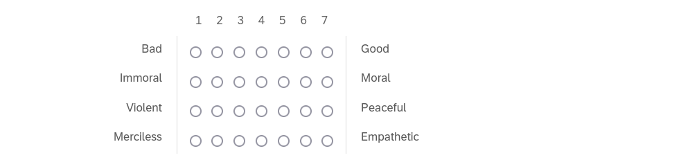
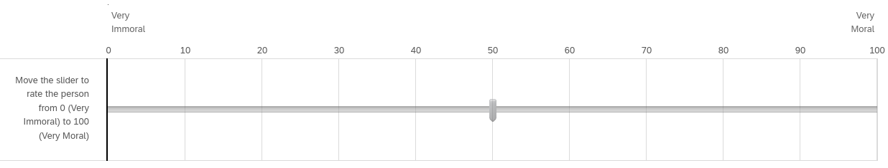

# Supplementary Materials

## Descriptions (Pilot Study 1 & Study 1)

### Diagnostic Descriptions
Each moral description contains descriptive information relating to three different moral foundations as follows: *Sam*: care, fairness, loyalty; *Robin*: care, fairness, loyalty; *Francis*: purity, authority, fairness; *Alex*: care, fairness, authority.

### Sam
Imagine a person named Sam.
Throughout their life they have been known to be cruel, act unfairly, and to betray their own group.

#### Robin
Imagine a person named Robin.
Throughout their life they have been known to physically hurt others, treat some people differently to others, and show lack of loyalty.

### Francis
Imagine a person named Francis.
Throughout their life they have been known to violate the standards of purity and decency, show lack of respect for authority, and treat people unequally.

### Alex
Imagine a person named Alex.
Throughout their life they have been known to cause others to suffer emotionally, to deny others their rights, and to cause chaos or disorder.

### Non-Diagnostic Descriptions
### Jackie
Imagine a person named Jackie.
They have red hair, play tennis four times a month, and have one older sibling and one younger sibling.

### Charlie
Imagine a person named Charlie.
They are left-handed, drink tea in the morning, and have two older siblings and one younger sibling.

## Descriptions (Pilot Study 2, Study 2 & Study 4)
### Diagnostic Descriptions
Each moral description contains descriptive information relating to three different moral foundations as follows: *Sam*: care, fairness, loyalty; *Robin*: care, fairness, loyalty; *Francis*: purity, authority, fairness; *Alex*: care, fairness, authority.

### Sam
Imagine a person named Sam.
Throughout their life they have been known to always help and care for others, treat everyone fairly and equally, and show a strong sense of loyalty to others.

### Robin
Imagine a person named Robin.
Throughout their life they have been known to show compassion and empathy for others, act with a sense of fairness and justice, and, never to break their word.

### Francis
Imagine a person named Francis.
Throughout their life they have been known to uphold the standards of purity and decency, show respect for authority, and to always act honestly and fairly.

### Alex
Imagine a person named Alex.
Throughout their life they have been known to protect and provide shelter to the weak and vulnerable, uphold the rights of others, and show respect for authority.

## Non-Diagnostic
### Jackie
Imagine a person named Jackie.
They have dark hair, go for a jog twice a week, and their favorite color is blue.

### Charlie
Imagine a person named Charlie.
They have blue eyes, drink coffee in the morning, and their favorite color is green.

## Descriptions (Study 3 & Study 5)
### Diagnostic Descriptions
#### Sam (good)
Imagine a person named Sam.
Throughout their life they have been known to always help and care for others, treat everyone fairly and equally, and show a strong sense of loyalty to others.

#### Robin (good)
Imagine a person named Robin.
Throughout their life they have been known to show compassion and empathy for others, act with a sense of fairness and justice, and, never to break their word.

#### Alex (bad)
Imagine a person named Alex.
Throughout their life they have been known to be cruel, act unfairly, and to betray their own group.

#### Francis (bad)
Imagine a person named Francis.
Throughout their life they have been known to physically hurt others, treat some people differently to others, and show lack of loyalty.

### Non Diagnostic Descriptions

They have red hair, play tennis four times a month, and have one older sibling and one younger sibling.

They are left-handed, drink tea in the morning, and have two older siblings and one younger sibling.

## Measures

### Four-item Moral Perception Scale (MPS-4)
Please rate ____ along the following dimensions:

### Four-item Moral Perception Scale (MM1-4)
Please rate ____ according to immoral or moral you view them:

