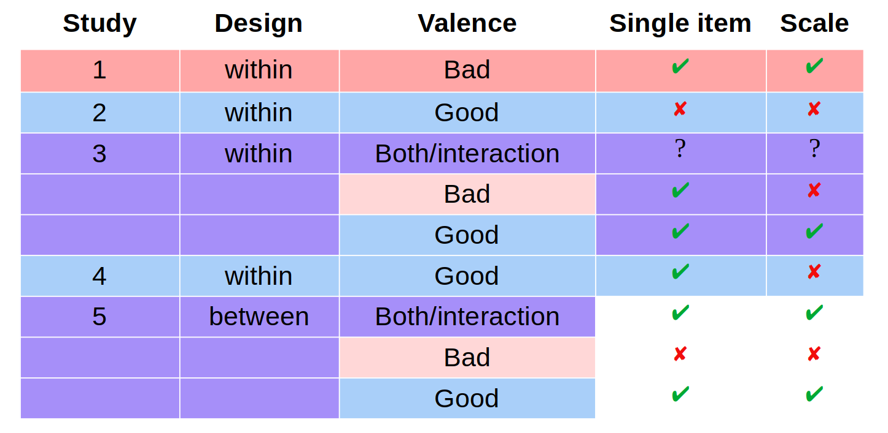
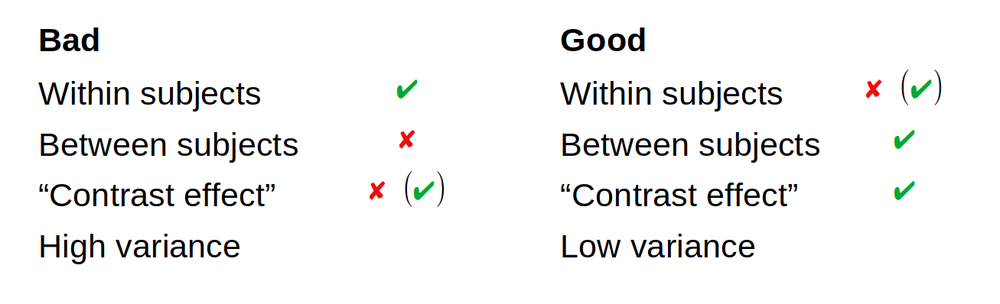

```{r setup, include=FALSE}
knitr::opts_chunk$set(echo = FALSE)
```

## Overview

- Recap Pilot 1 ([results](https://cillianmiltown.github.io/moral_dilution_online/pilot_sample_analysis.html))
- Recap Study 1: bad characters ([results](https://cillianmiltown.github.io/moral_dilution_online/study1_sample_analysis.html))
- Pilot 2 ([results](https://cillianmiltown.github.io/moral_dilution_online/pilot_2_sample_analysis.html))
- Study 2: good characters ([results](https://cillianmiltown.github.io/moral_dilution_online/study4_sample_analysis.html))
- Study 3: both good and bad ([results](https://cillianmiltown.github.io/moral_dilution_online/study5_sample_analysis.html))
- Study 4: good characters ([results](https://cillianmiltown.github.io/moral_dilution_online/study4_rep_sample_analysis.html))
- Study 5: both good and bad (between subjects) ([results](https://cillianmiltown.github.io/moral_dilution_online/study5_sample_analysis.html))
- Overview of results [here](https://cillianmiltown.github.io/moral_dilution_online/update_presentation_scroll.html) (or as slides [here](https://cillianmiltown.github.io/moral_dilution_online/update_presentation_scroll.html))

# Pilot Study 1 (Recap)

## Pilot Study 1


```{r, include = FALSE, results = "hide"}

rm(list = ls())
# devtools::install_github("cillianmiltown/R_desnum")
#install.packages("PowerTOST")
library(desnum)
library(psych)
library(corx)
library(nlme)
library(lme4)
library(TOSTER)
library(scales)
#install.packages("ez")
library(ez)
suppressMessages(library(tidyverse))
suppressMessages(library(car))
# library("PowerTOST")
```


```{r, include = FALSE}

source("pilot_set_up_data.R")
#source("pilot_simulating_data.R")
# create functions
#source("create_functions.R")

x <- full_long
x <- full_long_clean
length(x$gender)/6

sum(x$gender=="Female",na.rm = T)

```


- Developing materials

- 6 descriptions:
  - 4 morally relevant (diagnostic)
  - 2 neutral (non-diagnostic)

- MTurk sample, *N* = `r length(x$gender)/6`, (female = `r sum(x$gender=="Female",na.rm = T)/6`, male = `r sum(x$gender=="Male",na.rm = T)/6`, non-binary = `r sum(x$gender=="Non-binary / third gender",na.rm = T)/6`, prefer not to say = `r sum(x$gender=="Prefer not to say",na.rm = T)/6`, *M~age~* = `r round(mean(x$age,na.rm = T),digits=1)`, *SD* = `r round(sd(x$age,na.rm = T),digits=1)`).


## Materials: Moral Descriptions


- Imagine a person named Sam. Throughout their life they have been known to be cruel, act unfairly, and to betray their own group.

- Imagine a person named Robin. Throughout their life they have been known to physically hurt others, treat some people differently to others, and show lack of loyalty.

- Imagine a person named Francis.
Throughout their life they have been known to violate the standards of purity and decency, show lack of respect for authority, and treat people unequally.

- Imagine a person named Alex.
Throughout their life they have been known to cause others to suffer emotionally, to deny others their rights, and to cause chaos or disorder.


(adapted from Grizzard et al., 2020)

## Materials: Non-Diagnostic


- Imagine a person named Jackie. They have red hair, play tennis four times a month, and have one older sibling and one younger sibling.

- Imagine a person named Charlie. They are left-handed, drink tea in the morning, and have two older siblings and one younger sibling.


## Measures:


```{r, include=FALSE}
MPS <- x %>% 
  select(MP_R1,MP_R2,MP_R3,MP_R4)

alpha1 <- ltm::cronbach.alpha(MPS)

```

- DV1: Moral perceptions scale (Walker et al., 2021):
  - 7-point Likert
  - 4 items: Bad-Good, Moral-Immoral, Violent-Peaceful, Merciless-Empathetic
  - Cronbach's alpha = `r round(alpha1$alpha, digits=2)`

- DV2: Single item of moral perception (Walker et al., 2021).
  - 0-100 slider scale
  - Very Immoral-Very Moral


```{r include=FALSE}
x$ResponseId_factor <- as.factor(x$ResponseId)

ez::ezANOVA(data=x,dv=.(M_1),wid=.(ResponseId_factor),within=.(scenario_abb),type=3)

```


## Results (Single Item): Scenario


```{r include=TRUE}

ggplot(x,aes(x=scenario_abb,y=M_1))+
  geom_violin() +
  stat_summary(fun=mean, geom="point", shape=23, size=.5)+
  geom_boxplot(width=0.1)+
  #geom_dotplot(binaxis='y', stackdir='center', dotsize=.5)+
# violin plot with jittered points
# 0.2 : degree of jitter in x direction
  geom_jitter(shape=16, position=position_jitter(0.15), size = .3, color="dark grey")
# violin plot with median points
#p + stat_summary(fun.y=median, geom="point", size=.2, color="red")

```


## Results (Single Item): Condition


```{r, include = FALSE}
M1 <- x %>% 
  select("ResponseId","condition","scenario_abb","M_1") %>% 
  pivot_wider(names_from = scenario_abb, values_from = M_1)

M1$M1 <- NA

D <- M1[which(M1$condition=="Diagnostic"),]
ND <- M1[which(M1$condition=="Non-Diagnostic"),]

#D$M1 <- 
D$M1 <- D %>% select("Sam","Francis","Alex","Robin") %>% rowMeans()
ND$M1 <- ND %>% select("Charlie","Jackie") %>% rowMeans()

M2 <- rbind(D,ND)
M3 <- M2 %>% 
  select("ResponseId","condition","M1") %>% 
  pivot_wider(names_from = condition, values_from = M1)

M4 <- 
M3 %>% pivot_longer(
  cols = c("Diagnostic","Non-Diagnostic"),
  names_to = "condition",
  values_to = "M1"
)

t <- t.test(M3$Diagnostic,M3$`Non-Diagnostic`,paired = T)

t_paired_paragraph2 <- function (x, y, measure) 
{
  t <- t.test(x, y, paired = TRUE)
  d <- lsr::cohensD(x,y,method = "paired")
  d <- round(d,digits = 2)
  labels <- measure
  tsl <- as.vector(t$statistic)
  ts <- round(tsl, digits = 3)
  tpl <- as.vector(t$p.value)
  tp <- round(tpl, digits = 3)
  d_fl <- as.vector(t$parameter)
  d_f <- round(d_fl, digits = 2)
  mxl <- as.vector(mean(x))
  mx <- round(mxl, digits = 2)
  myl <- as.vector(mean(y))
  my <- round(myl, digits = 2)
  sdxl <- as.vector(sd(x))
  sdx <- round(sdxl, digits = 2)
  sdyl <- as.vector(sd(y))
  sdy <- round(sdyl, digits = 2)
  if (tp < 0.05) 
    print(paste0("A paired samples t-test revealed a significant difference in ", 
                 measure, " between the Diagnostic Condition, (M = ", mx, ", SD = ", 
                 sdx, "), and the Non-Diagnostic condition, (M =", my, ", SD = ", sdy, 
                 "), t(", d_f, ") = ", ts, ", p = ", tp, ", d = ", d, "."), quote = FALSE)
  if (tp > 0.05) 
    print(paste0("A paired samples t-test revealed no difference in ", 
                 measure, " between the Diagnostic Condition, (M = ", mx, ", SD = ", 
                 sdx, "), and the Non-Diagnostic Condition, (M =", my, ", SD = ", sdy, 
                 "), t(", d_f, ") = ", ts, ", p = ", tp, ", d = ", d, "."), quote = FALSE)
}
test <- print(t_paired_paragraph2(M3$Diagnostic,M3$`Non-Diagnostic`, "moral Perception"))

```


A paired samples t-test revealed a significant difference in moral Perception between the Diagnostic Condition, (*M* = 56.54, *SD* = 28.56), and the Non-Diagnostic condition, (*M* =72.97, *SD* = 13.89), *t*(211) = -8.735, *p* < .001, *d* = 0.6.

## Results (Single Item): Condition


```{r, include=TRUE}

ggplot(M4,aes(x=condition,y=M1))+
  geom_violin() +
  stat_summary(fun=mean, geom="point", shape=23, size=2)+
  geom_boxplot(width=0.1)+
#  geom_dotplot(binaxis='y', stackdir='center', dotsize=.05)+
# violin plot with jittered points
# 0.2 : degree of jitter in x direction
  geom_jitter(shape=16, position=position_jitter(0.15), size=.8, color="dark grey")
# violin plot with median points
#p + stat_summary(fun.y=median, geom="point", size=.2, color="red")

```


```{r include=FALSE}

# 
# 
# model1 <- lme4::lmer(M_1 ~
#                   condition+
#                     scenario_abb
#                 + (1|ResponseId)
#                 , data = x
#                # , family=gaussian
#             )
# 
# model2 <- lme4::lmer(M_1 ~
#                   scenario_abb+condition
#                 + (1|ResponseId)
#                 , data = x
#                # , family=gaussian
#             )
# summary(model1)
# summary(model2)
# 
# 
# anova(model1,model2)
# 
# 
# m0 <- nlme::lme(M_1 ~ 
#                   1
#                 , random=~1|ResponseId
#                 , data=x
#                 , method = "ML")
# m1 <- nlme::lme(M_1 ~ 
#                   condition 
#                   + scenario_abb
#                 , random=~1|ResponseId
#                 , data=x
#                 , method = "ML")
# 
# summary(m1)
# anova(m1)
# 

test.aov <- with(x,
                   aov(M_1 ~ condition + scenario_abb + #(condition * scenario) +
                       Error(ResponseId / (condition * scenario_abb)))
)

```

```{r include=FALSE}

summary(test.aov)


```


```{r, include=FALSE}

x$MPS <- 
  x %>% 
  select(MP_R1,MP_R2,MP_R3,MP_R4) %>% 
  rowMeans()

```


```{r, include=FALSE}

ez::ezANOVA(data=x,dv=.(MPS),wid=.(ResponseId_factor),within=.(scenario_abb),type=3)

```


## Results (Scale): Scenario


```{r include=TRUE}

ggplot(x,aes(x=scenario_abb,y=MPS))+
  geom_violin() +
  stat_summary(fun=mean, geom="point", shape=23, size=.5)+
  geom_boxplot(width=0.1)+
  #geom_dotplot(binaxis='y', stackdir='center', dotsize=.5)+
# violin plot with jittered points
# 0.2 : degree of jitter in x direction
  geom_jitter(shape=16, position=position_jitter(0.15), size = .3, color="dark grey")
# violin plot with median points
#p + stat_summary(fun.y=median, geom="point", size=.2, color="red")

```


## Results (Scale): Condition


```{r, include=FALSE}
M1 <- x %>% 
  select("ResponseId","condition","scenario_abb","MPS") %>% 
  pivot_wider(names_from = scenario_abb, values_from = MPS)

M1$M1 <- NA

D <- M1[which(M1$condition=="Diagnostic"),]
ND <- M1[which(M1$condition=="Non-Diagnostic"),]

#D$M1 <- 
D$M1 <- D %>% select("Sam","Francis","Alex","Robin") %>% rowMeans()
ND$M1 <- ND %>% select("Charlie","Jackie") %>% rowMeans()

M2 <- rbind(D,ND)
M3 <- M2 %>% 
  select("ResponseId","condition","M1") %>% 
  pivot_wider(names_from = condition, values_from = M1)

M4 <- 
M3 %>% pivot_longer(
  cols = c("Diagnostic","Non-Diagnostic"),
  names_to = "condition",
  values_to = "M1"
)

t <- t.test(M3$Diagnostic,M3$`Non-Diagnostic`,paired = T)

t_paired_paragraph2 <- function (x, y, measure) 
{
  t <- t.test(x, y, paired = TRUE)
  d <- lsr::cohensD(x,y,method = "paired")
  d <- round(d,digits = 2)
  labels <- measure
  tsl <- as.vector(t$statistic)
  ts <- round(tsl, digits = 3)
  tpl <- as.vector(t$p.value)
  tp <- round(tpl, digits = 3)
  d_fl <- as.vector(t$parameter)
  d_f <- round(d_fl, digits = 2)
  mxl <- as.vector(mean(x))
  mx <- round(mxl, digits = 2)
  myl <- as.vector(mean(y))
  my <- round(myl, digits = 2)
  sdxl <- as.vector(sd(x))
  sdx <- round(sdxl, digits = 2)
  sdyl <- as.vector(sd(y))
  sdy <- round(sdyl, digits = 2)
  if (tp < 0.05) 
    print(paste0("A paired samples t-test revealed a significant difference in ", 
                 measure, " between the Diagnostic Condition, (M = ", mx, ", SD = ", 
                 sdx, "), and the Non-Diagnostic condition, (M =", my, ", SD = ", sdy, 
                 "), t(", d_f, ") = ", ts, ", p = ", tp, ", d = ", d, "."), quote = FALSE)
  if (tp > 0.05) 
    print(paste0("A paired samples t-test revealed no difference in ", 
                 measure, " between the Diagnostic Condition, (M = ", mx, ", SD = ", 
                 sdx, "), and the Non-Diagnostic Condition, (M =", my, ", SD = ", sdy, 
                 "), t(", d_f, ") = ", ts, ", p = ", tp, ", d = ", d, "."), quote = FALSE)
}
test <- print(t_paired_paragraph2(M3$Diagnostic,M3$`Non-Diagnostic`, "moral Perception"))

```


A paired samples t-test revealed a significant difference in moral Perception between the Diagnostic Condition, (*M* = 4.4, *SD* = 175), and the Non-Diagnostic condition, (*M* = 5.39, *SD* = .98), *t*(211) = -8.655, *p* < .001, *d* = 0.59.

## Results (Scale): Condition


```{r, include=TRUE}

ggplot(x,aes(x=condition,y=MPS))+
  geom_violin() +
  stat_summary(fun=mean, geom="point", shape=23, size=2)+
  geom_boxplot(width=0.1)+
#  geom_dotplot(binaxis='y', stackdir='center', dotsize=.05)+
# violin plot with jittered points
# 0.2 : degree of jitter in x direction
  geom_jitter(shape=16, position=position_jitter(0.15), size=.8, color="dark grey")
# violin plot with median points
#p + stat_summary(fun.y=median, geom="point", size=.2, color="red")

```


## Combined (Scale - Condition & Scenario)


```{r include=FALSE}

# 
# 
# model1 <- lme4::lmer(M_1 ~
#                   condition+
#                     scenario_abb
#                 + (1|ResponseId)
#                 , data = x
#                # , family=gaussian
#             )
# 
# model2 <- lme4::lmer(M_1 ~
#                   scenario_abb+condition
#                 + (1|ResponseId)
#                 , data = x
#                # , family=gaussian
#             )
# summary(model1)
# summary(model2)
# 
# 
# anova(model1,model2)
# 
# 
# m0 <- nlme::lme(M_1 ~ 
#                   1
#                 , random=~1|ResponseId
#                 , data=x
#                 , method = "ML")
# m1 <- nlme::lme(M_1 ~ 
#                   condition 
#                   + scenario_abb
#                 , random=~1|ResponseId
#                 , data=x
#                 , method = "ML")
# 
# summary(m1)
# anova(m1)
# 

test.aov <- with(x,
                   aov(MPS ~ condition + scenario_abb + #(condition * scenario) +
                       Error(ResponseId / (condition * scenario_abb)))
)

```

```{r include=TRUE}

summary(test.aov)


```

# Study 1 (Recap)


```{r, echo=FALSE}
## Run Script to set up Data

source("study1_set_up_data.R")

#source("pilot_simulating_data.R")
# create functions
#source("create_functions.R")

x <- df_long
x <- df_long_clean


# sum(x$gender=="1",na.rm = T)/4

```


## Study 1


## Study 1: Design

- Within subjects design
  - IV: Diagnostic information (present/absent)
  - 4 descriptions
  - Randomly assigned to contain diagnostic information vs not


- Imagine a person named Sam. Throughout their life they have been known to be cruel, act unfairly, and to betray their own group.
- Imagine a person named Sam. Throughout their life they have been known to be cruel, act unfairly, and to betray their own group. *They are left-handed, drink tea in the morning, and have two older siblings and one younger sibling.*


## Materials: Moral Descriptions


- Imagine a person named Sam. Throughout their life they have been known to be cruel, act unfairly, and to betray their own group.

- Imagine a person named Robin. Throughout their life they have been known to physically hurt others, treat some people differently to others, and show lack of loyalty.

- Imagine a person named Francis.
Throughout their life they have been known to violate the standards of purity and decency, show lack of respect for authority, and treat people unequally.

- Imagine a person named Alex.
Throughout their life they have been known to cause others to suffer emotionally, to deny others their rights, and to cause chaos or disorder.


## Materials: Non-Diagnostic


- They have red hair, play tennis four times a month, and have one older sibling and one younger sibling.

- They are left-handed, drink tea in the morning, and have two older siblings and one younger sibling.


```{r include=FALSE}
## Measures


MPS <- x %>% 
  select(R1,R2,R3,R4)

alpha1 <- ltm::cronbach.alpha(MPS)

alpha1

```

```{r inculde=FALSE}
# length(x$gender)/4
# sum(x$gender=="1")/4
# sum(x$gender=="2")/4
# sum(x$gender=="3")/4
# sum(x$gender=="4")/4
# sum(x$gender=="5")/4
# 
# # 1 = male
# # 2 = female
# # 3 = non-binary
# # 4 = prefer to self describe
# # 5 = prefer not to say
# 
# round(mean(x$age),digits=1)

```


```{r include=FALSE}
## Measures


MPS <- x %>% 
  select(R1,R2,R3,R4)

alpha1 <- ltm::cronbach.alpha(MPS)

alpha1

```

## Study 1


- DV1: Moral perceptions scale (Walker et al., 2021):
  - 7-point Likert
  - 4 items: Bad-Good, Moral-Immoral, Violent-Peaceful, Merciless-Empathetic
  - Cronbach's alpha = `r round(alpha1$alpha, digits=2)`

- DV2: Single item of moral perception (Walker et al., 2021).
  - 0-100 slider scale
  - Very Immoral-Very Moral

UL Students with a total sample of *N* = `r length(x$gender)/4`, (female = `r sum(x$gender=="2")/4`, male = `r sum(x$gender=="1")/4`, non-binary/other = `r sum(x$gender=="3")/4 + sum(x$gender=="5")/4`, prefer not to say `r sum(x$gender=="5")/4`, *M~age~* = `r round(mean(x$age),digits=1)`, *SD* = `r round(sd(x$age),digits=1)`).

## Results: Single Item Measure


```{r include=FALSE}

model1 <- lme4::lmer(M1 ~
                  condition+scenario
                + (1|ResponseId)
                , data = x
               # , family=gaussian
            )
summary(model1)
anova(model1)


library(nlme)

m0 <- nlme::lme(M1 ~ 
                  1
                , random=~1|ResponseId
                , data=x
                , method = "ML")
m1 <- nlme::lme(M1 ~ 
                  condition*scenario
                , random=~1|ResponseId
                , data=x
                , method = "ML")
summary(m1)


anova(m0,m1)
```

```{r include=TRUE}

anova(m1)

```


## Differences by Condition (single item)


```{r, include=TRUE}

ggplot(x,aes(x=condition,y=M1))+
  geom_violin() +
  stat_summary(fun=mean, geom="point", shape=23, size=2)+
  geom_boxplot(width=0.1)+
#  geom_dotplot(binaxis='y', stackdir='center', dotsize=.05)+
# violin plot with jittered points
# 0.2 : degree of jitter in x direction
  geom_jitter(shape=16, position=position_jitter(0.15), size=.3, color="dark grey")
# violin plot with median points
#p + stat_summary(fun.y=median, geom="point", size=.2, color="red")

```

## Differences by Scenario (single item)


```{r include=TRUE}

ggplot(x,aes(x=scenario,y=M1))+
  geom_violin() +
  stat_summary(fun=mean, geom="point", shape=23, size=.5)+
  geom_boxplot(width=0.1)+
  #geom_dotplot(binaxis='y', stackdir='center', dotsize=.5)+
# violin plot with jittered points
# 0.2 : degree of jitter in x direction
  geom_jitter(shape=16, position=position_jitter(0.15), size = .3, color="dark grey")
# violin plot with median points
#p + stat_summary(fun.y=median, geom="point", size=.2, color="red")

```


## Results: Scale


```{r include=FALSE}

# model1 <- lme4::lmer(R_tot ~ 
#                   condition+scenario
#                 + (1|ResponseId)
#                 , data = x
#                # , family=gaussian
#             )
# anova(model1)


library(nlme)
m1 <- nlme::lme(R_tot ~ 
                  condition*scenario
                , random=~1|ResponseId
                , data=x)
summary(m1)

```

```{r include=TRUE}

anova(m1)

```

## Differences by Condition (scale)


```{r, include=TRUE}

ggplot(x,aes(x=condition,y=R_tot))+
  geom_violin() +
  stat_summary(fun=mean, geom="point", shape=23, size=2)+
  geom_boxplot(width=0.1)+
#  geom_dotplot(binaxis='y', stackdir='center', dotsize=.05)+
# violin plot with jittered points
# 0.2 : degree of jitter in x direction
  geom_jitter(shape=16, position=position_jitter(0.15), size=.3, color="dark grey")
# violin plot with median points
#p + stat_summary(fun.y=median, geom="point", size=.2, color="red")

```

## Differences by Scenario (scale)


```{r include=TRUE}

ggplot(x,aes(x=scenario,y=R_tot))+
  geom_violin() +
  stat_summary(fun=mean, geom="point", shape=23, size=.5)+
  geom_boxplot(width=0.1)+
  #geom_dotplot(binaxis='y', stackdir='center', dotsize=.5)+
# violin plot with jittered points
# 0.2 : degree of jitter in x direction
  geom_jitter(shape=16, position=position_jitter(0.15), size = .3, color="dark grey")
# violin plot with median points
#p + stat_summary(fun.y=median, geom="point", size=.2, color="red")

```


# Pilot Study 2

## Pilot Study 2


```{r, include = FALSE, results = "hide"}

rm(list = ls())
# devtools::install_github("cillianmiltown/R_desnum")
#install.packages("PowerTOST")
library(desnum)
library(psych)
library(corx)
library(nlme)
library(lme4)
library(TOSTER)
library(scales)
#install.packages("ez")
suppressMessages(library(tidyverse))
suppressMessages(library(car))
# library("PowerTOST")
```


```{r, include = FALSE}

source("pilot_2_set_up_data.R")
#source("pilot_simulating_data.R")
# create functions
#source("create_functions.R")

x <- full_long
x <- full_long_clean
length(x$gender)/6

sum(x$gender=="Female",na.rm = T)

```


- Developing materials

- 6 descriptions:
  - 4 morally relevant (diagnostic)
  - 2 neutral (non-diagnostic)

- MTurk sample, *N* = `r length(x$gender)/6`, (female = `r sum(x$gender=="Female",na.rm = T)/6`, male = `r sum(x$gender=="Male",na.rm = T)/6`, non-binary = `r sum(x$gender=="Non-binary / third gender",na.rm = T)/6`, prefer not to say = `r sum(x$gender=="Prefer not to say",na.rm = T)/6`, *M~age~* = `r round(mean(x$age,na.rm = T),digits=1)`, *SD* = `r round(sd(x$age,na.rm = T),digits=1)`).


## Materials: Moral Descriptions


- Imagine a person named Sam. Throughout their life they have been known to always help and care for others, treat everyone fairly and equally, and show a strong sense of loyalty to others.

- Imagine a person named Robin. Throughout their life they have been known to show compassion and empathy for others, act with a sense of fairness and justice, and, never to break their word.

- Imagine a person named Francis.
Throughout their life they have been known to uphold the standards of purity and decency, show respect for authority, and to always act honestly and fairly.

- Imagine a person named Alex. Throughout their life they have been known to protect and provide shelter to the weak and vulnerable, uphold the rights of others, and show respect for authority.


## Materials: Non-Diagnostic


- Imagine a person named Jackie. They have dark hair, go for a jog twice a week, and their favourite colour is blue.

- Imagine a person named Charlie. They have blue eyes, drink coffee in the morning, and their favourite colour is green.


## Measures:


```{r, include=FALSE}
MPS <- x %>% 
  select(MP_R1,MP_R2,MP_R3,MP_R4)

alpha1 <- ltm::cronbach.alpha(MPS)

```

- DV1: Moral perceptions scale (Walker et al., 2021):
  - 7-point Likert
  - 4 items: Bad-Good, Moral-Immoral, Violent-Peaceful, Merciless-Empathetic
  - Cronbach's alpha = `r round(alpha1$alpha, digits=2)`

- DV2: Single item of moral perception (Walker et al., 2021).
  - 0-100 slider scale
  - Very Immoral-Very Moral


```{r include=FALSE}
x$ResponseId_factor <- as.factor(x$ResponseId)

ez::ezANOVA(data=x,dv=.(M_1),wid=.(ResponseId_factor),within=.(scenario_abb),type=3)

```


## Results (Single Item): Scenario


```{r include=TRUE}

ggplot(x,aes(x=scenario_abb,y=M_1))+
  geom_violin() +
  stat_summary(fun=mean, geom="point", shape=23, size=.5)+
  geom_boxplot(width=0.1)+
  #geom_dotplot(binaxis='y', stackdir='center', dotsize=.5)+
# violin plot with jittered points
# 0.2 : degree of jitter in x direction
  geom_jitter(shape=16, position=position_jitter(0.15), size = .3, color="dark grey")
# violin plot with median points
#p + stat_summary(fun.y=median, geom="point", size=.2, color="red")

```


## Results (Single Item): Condition


```{r, include = FALSE}
M1 <- x %>% 
  select("ResponseId","condition","scenario_abb","M_1") %>% 
  pivot_wider(names_from = scenario_abb, values_from = M_1)

M1$M1 <- NA

D <- M1[which(M1$condition=="Diagnostic"),]
ND <- M1[which(M1$condition=="Non-Diagnostic"),]

#D$M1 <- 
D$M1 <- D %>% select("Sam","Francis","Alex","Robin") %>% rowMeans()
ND$M1 <- ND %>% select("Charlie","Jackie") %>% rowMeans()

M2 <- rbind(D,ND)
M3 <- M2 %>% 
  select("ResponseId","condition","M1") %>% 
  pivot_wider(names_from = condition, values_from = M1)

M4 <- 
M3 %>% pivot_longer(
  cols = c("Diagnostic","Non-Diagnostic"),
  names_to = "condition",
  values_to = "M1"
)

t <- t.test(M3$Diagnostic,M3$`Non-Diagnostic`,paired = T)

t_paired_paragraph2 <- function (x, y, measure) 
{
  t <- t.test(x, y, paired = TRUE)
  d <- lsr::cohensD(x,y,method = "paired")
  d <- round(d,digits = 2)
  labels <- measure
  tsl <- as.vector(t$statistic)
  ts <- round(tsl, digits = 3)
  tpl <- as.vector(t$p.value)
  tp <- round(tpl, digits = 3)
  d_fl <- as.vector(t$parameter)
  d_f <- round(d_fl, digits = 2)
  mxl <- as.vector(mean(x))
  mx <- round(mxl, digits = 2)
  myl <- as.vector(mean(y))
  my <- round(myl, digits = 2)
  sdxl <- as.vector(sd(x))
  sdx <- round(sdxl, digits = 2)
  sdyl <- as.vector(sd(y))
  sdy <- round(sdyl, digits = 2)
  if (tp < 0.05) 
    print(paste0("A paired samples t-test revealed a significant difference in ", 
                 measure, " between the Diagnostic Condition, (M = ", mx, ", SD = ", 
                 sdx, "), and the Non-Diagnostic condition, (M =", my, ", SD = ", sdy, 
                 "), t(", d_f, ") = ", ts, ", p = ", tp, ", d = ", d, "."), quote = FALSE)
  if (tp > 0.05) 
    print(paste0("A paired samples t-test revealed no difference in ", 
                 measure, " between the Diagnostic Condition, (M = ", mx, ", SD = ", 
                 sdx, "), and the Non-Diagnostic Condition, (M =", my, ", SD = ", sdy, 
                 "), t(", d_f, ") = ", ts, ", p = ", tp, ", d = ", d, "."), quote = FALSE)
}
test <- print(t_paired_paragraph2(M3$Diagnostic,M3$`Non-Diagnostic`, "moral Perception"))

```


A paired samples t-test revealed a significant difference in moral Perception between the Diagnostic Condition, (*M* = 56.54, *SD* = 28.56), and the Non-Diagnostic condition, (*M* =72.97, *SD* = 13.89), *t*(211) = -8.735, *p* < .001, *d* = 0.6.

## Results (Single Item): Condition


```{r, include=TRUE}

ggplot(M4,aes(x=condition,y=M1))+
  geom_violin() +
  stat_summary(fun=mean, geom="point", shape=23, size=2)+
  geom_boxplot(width=0.1)+
#  geom_dotplot(binaxis='y', stackdir='center', dotsize=.05)+
# violin plot with jittered points
# 0.2 : degree of jitter in x direction
  geom_jitter(shape=16, position=position_jitter(0.15), size=.8, color="dark grey")
# violin plot with median points
#p + stat_summary(fun.y=median, geom="point", size=.2, color="red")

```


```{r include=FALSE}

# 
# 
# model1 <- lme4::lmer(M_1 ~
#                   condition+
#                     scenario_abb
#                 + (1|ResponseId)
#                 , data = x
#                # , family=gaussian
#             )
# 
# model2 <- lme4::lmer(M_1 ~
#                   scenario_abb+condition
#                 + (1|ResponseId)
#                 , data = x
#                # , family=gaussian
#             )
# summary(model1)
# summary(model2)
# 
# 
# anova(model1,model2)
# 
# 
# m0 <- nlme::lme(M_1 ~ 
#                   1
#                 , random=~1|ResponseId
#                 , data=x
#                 , method = "ML")
# m1 <- nlme::lme(M_1 ~ 
#                   condition 
#                   + scenario_abb
#                 , random=~1|ResponseId
#                 , data=x
#                 , method = "ML")
# 
# summary(m1)
# anova(m1)
# 

test.aov <- with(x,
                   aov(M_1 ~ condition + scenario_abb + #(condition * scenario) +
                       Error(ResponseId / (condition * scenario_abb)))
)

```

```{r include=FALSE}

summary(test.aov)


```


```{r, include=FALSE}

x$MPS <- 
  x %>% 
  select(MP_R1,MP_R2,MP_R3,MP_R4) %>% 
  rowMeans()

```


```{r, include=FALSE}

ez::ezANOVA(data=x,dv=.(MPS),wid=.(ResponseId_factor),within=.(scenario_abb),type=3)

```


## Results (Scale): Scenario


```{r include=TRUE}

ggplot(x,aes(x=scenario_abb,y=MPS))+
  geom_violin() +
  stat_summary(fun=mean, geom="point", shape=23, size=.5)+
  geom_boxplot(width=0.1)+
  #geom_dotplot(binaxis='y', stackdir='center', dotsize=.5)+
# violin plot with jittered points
# 0.2 : degree of jitter in x direction
  geom_jitter(shape=16, position=position_jitter(0.15), size = .3, color="dark grey")
# violin plot with median points
#p + stat_summary(fun.y=median, geom="point", size=.2, color="red")

```


## Results (Scale): Condition


```{r, include=FALSE}
M1 <- x %>% 
  select("ResponseId","condition","scenario_abb","MPS") %>% 
  pivot_wider(names_from = scenario_abb, values_from = MPS)

M1$M1 <- NA

D <- M1[which(M1$condition=="Diagnostic"),]
ND <- M1[which(M1$condition=="Non-Diagnostic"),]

#D$M1 <- 
D$M1 <- D %>% select("Sam","Francis","Alex","Robin") %>% rowMeans()
ND$M1 <- ND %>% select("Charlie","Jackie") %>% rowMeans()

M2 <- rbind(D,ND)
M3 <- M2 %>% 
  select("ResponseId","condition","M1") %>% 
  pivot_wider(names_from = condition, values_from = M1)

M4 <- 
M3 %>% pivot_longer(
  cols = c("Diagnostic","Non-Diagnostic"),
  names_to = "condition",
  values_to = "M1"
)

t <- t.test(M3$Diagnostic,M3$`Non-Diagnostic`,paired = T)

t_paired_paragraph2 <- function (x, y, measure) 
{
  t <- t.test(x, y, paired = TRUE)
  d <- lsr::cohensD(x,y,method = "paired")
  d <- round(d,digits = 2)
  labels <- measure
  tsl <- as.vector(t$statistic)
  ts <- round(tsl, digits = 3)
  tpl <- as.vector(t$p.value)
  tp <- round(tpl, digits = 3)
  d_fl <- as.vector(t$parameter)
  d_f <- round(d_fl, digits = 2)
  mxl <- as.vector(mean(x))
  mx <- round(mxl, digits = 2)
  myl <- as.vector(mean(y))
  my <- round(myl, digits = 2)
  sdxl <- as.vector(sd(x))
  sdx <- round(sdxl, digits = 2)
  sdyl <- as.vector(sd(y))
  sdy <- round(sdyl, digits = 2)
  if (tp < 0.05) 
    print(paste0("A paired samples t-test revealed a significant difference in ", 
                 measure, " between the Diagnostic Condition, (M = ", mx, ", SD = ", 
                 sdx, "), and the Non-Diagnostic condition, (M =", my, ", SD = ", sdy, 
                 "), t(", d_f, ") = ", ts, ", p = ", tp, ", d = ", d, "."), quote = FALSE)
  if (tp > 0.05) 
    print(paste0("A paired samples t-test revealed no difference in ", 
                 measure, " between the Diagnostic Condition, (M = ", mx, ", SD = ", 
                 sdx, "), and the Non-Diagnostic Condition, (M =", my, ", SD = ", sdy, 
                 "), t(", d_f, ") = ", ts, ", p = ", tp, ", d = ", d, "."), quote = FALSE)
}
test <- print(t_paired_paragraph2(M3$Diagnostic,M3$`Non-Diagnostic`, "moral Perception"))

```


A paired samples t-test revealed a significant difference in moral Perception between the Diagnostic Condition, (*M* = 4.4, *SD* = 175), and the Non-Diagnostic condition, (*M* = 5.39, *SD* = .98), *t*(211) = -8.655, *p* < .001, *d* = 0.59.

## Results (Scale): Condition


```{r, include=TRUE}

ggplot(x,aes(x=condition,y=MPS))+
  geom_violin() +
  stat_summary(fun=mean, geom="point", shape=23, size=2)+
  geom_boxplot(width=0.1)+
#  geom_dotplot(binaxis='y', stackdir='center', dotsize=.05)+
# violin plot with jittered points
# 0.2 : degree of jitter in x direction
  geom_jitter(shape=16, position=position_jitter(0.15), size=.8, color="dark grey")
# violin plot with median points
#p + stat_summary(fun.y=median, geom="point", size=.2, color="red")

```


## Combined (Scale - Condition & Scenario)


```{r include=FALSE}

# 
# 
# model1 <- lme4::lmer(M_1 ~
#                   condition+
#                     scenario_abb
#                 + (1|ResponseId)
#                 , data = x
#                # , family=gaussian
#             )
# 
# model2 <- lme4::lmer(M_1 ~
#                   scenario_abb+condition
#                 + (1|ResponseId)
#                 , data = x
#                # , family=gaussian
#             )
# summary(model1)
# summary(model2)
# 
# 
# anova(model1,model2)
# 
# 
# m0 <- nlme::lme(M_1 ~ 
#                   1
#                 , random=~1|ResponseId
#                 , data=x
#                 , method = "ML")
# m1 <- nlme::lme(M_1 ~ 
#                   condition 
#                   + scenario_abb
#                 , random=~1|ResponseId
#                 , data=x
#                 , method = "ML")
# 
# summary(m1)
# anova(m1)
# 

test.aov <- with(x,
                   aov(MPS ~ condition + scenario_abb + #(condition * scenario) +
                       Error(ResponseId / (condition * scenario_abb)))
)

```

```{r include=TRUE}

summary(test.aov)


```

# Study 2


```{r, echo=FALSE}
## Run Script to set up Data

source("study4_set_up_data.R")


#source("pilot_simulating_data.R")
# create functions
#source("create_functions.R")

x <- df_long
x <- df_long_clean


#sum(x$gender=="1",na.rm = T)/4

```


## Study 2


## Study 2: Design

- Within subjects design
  - IV: Diagnostic information (present/absent)
  - 4 descriptions
  - Randomly assigned to contain diagnostic information vs not


- Imagine a person named Sam. Throughout their life they have been known to always help and care for others, treat everyone fairly and equally, and show a strong sense of loyalty to others.
- Imagine a person named Sam. Throughout their life they have been known to always help and care for others, treat everyone fairly and equally, and show a strong sense of loyalty to others. *They have dark hair, go for a jog twice a week, and their favourite colour is blue*


## Materials: Moral Descriptions


- Imagine a person named Sam. Throughout their life they have been known to always help and care for others, treat everyone fairly and equally, and show a strong sense of loyalty to others.

- Imagine a person named Robin. Throughout their life they have been known to show compassion and empathy for others, act with a sense of fairness and justice, and, never to break their word.

- Imagine a person named Francis.
Throughout their life they have been known to uphold the standards of purity and decency, show respect for authority, and to always act honestly and fairly.

- Imagine a person named Alex. Throughout their life they have been known to protect and provide shelter to the weak and vulnerable, uphold the rights of others, and show respect for authority.


## Materials: Non-Diagnostic


- They have dark hair, go for a jog twice a week, and their favourite colour is blue.

- They have blue eyes, drink coffee in the morning, and their favourite colour is green.


```{r include=FALSE}
## Measures


MPS <- x %>% 
  select(R1,R2,R3,R4)

alpha1 <- ltm::cronbach.alpha(MPS)

alpha1

```

```{r inculde=FALSE}
# length(x$gender)/4
# sum(x$gender=="1")/4
# sum(x$gender=="2")/4
# sum(x$gender=="3")/4
# sum(x$gender=="4")/4
# sum(x$gender=="5")/4
# 
# # 1 = male
# # 2 = female
# # 3 = non-binary
# # 4 = prefer to self describe
# # 5 = prefer not to say
# 
# round(mean(x$age),digits=1)

```


```{r include=FALSE}
## Measures


MPS <- x %>% 
  select(R1,R2,R3,R4)

alpha1 <- ltm::cronbach.alpha(MPS)

alpha1

```


## Study 2 Measures (Same as previous)


- DV1: Moral perceptions scale, 7-point Likert; 4 items: Bad-Good, Moral-Immoral, Violent-Peaceful, Merciless-Empathetic; Cronbach's alpha = `r round(alpha1$alpha, digits=2)`

- DV2: Single item of moral perception; 0-100 slider scale; Very Immoral-Very Moral
  
Total sample of *N* = `r length(x$gender)/4`, (female = `r sum(x$gender=="2")/4`, male = `r sum(x$gender=="1")/4`, non-binary/other = `r sum(x$gender=="3")/4 + sum(x$gender=="5")/4`, prefer not to say `r sum(x$gender=="5")/4`, *M~age~* = `r round(mean(x$age),digits=1)`, *SD* = `r round(sd(x$age),digits=1)`).
```{r}
x <- df_long_clean
x <- x[which(x$Sample=="student"),]
```

The majority of participants were from the student body: *n* = `r length(x$gender)/4`, (female = `r sum(x$gender=="2")/4`, male = `r sum(x$gender=="1")/4`, non-binary/other = `r sum(x$gender=="3")/4 + sum(x$gender=="5")/4`, prefer not to say `r sum(x$gender=="5")/4`, *M~age~* = `r round(mean(x$age),digits=1)`, *SD* = `r round(sd(x$age),digits=1)`).

```{r}
x <- df_long_clean
x <- x[which(x$Sample=="MTurk"),]
```

In order to reach our pre-registered target sample size we recruited additional participants from MTurk: *n* = `r length(x$gender)/4`, (female = `r sum(x$gender=="2")/4`, male = `r sum(x$gender=="1")/4`, non-binary/other = `r sum(x$gender=="3")/4 + sum(x$gender=="5")/4`, prefer not to say `r sum(x$gender=="5")/4`, *M~age~* = `r round(mean(x$age),digits=1)`, *SD* = `r round(sd(x$age),digits=1)`).

```{r}
x <- df_long_clean
```


## Results: Single Item Measure


```{r include=FALSE}

model1 <- lme4::lmer(M1 ~
                  condition+scenario
                + (1|ResponseId)
                , data = x
               # , family=gaussian
            )

model1 <- lmerTest::lmer(M1 ~
                  condition+scenario
                + (1|ResponseId)
                + (1|ResponseId:condition)
             #   + (1|ResponseId:scenario)
               # + (1|ResponseId:condition:scenario)
                , data = x
               # , family=gaussian
            )
summary(model1)
anova(model1)


library(nlme)

m0 <- nlme::lme(M1 ~ 
                  1
                , random=~1|ResponseId
                , data=x
                , method = "ML")
m1 <- nlme::lme(M1 ~ 
                  condition*scenario
                , random=~1|ResponseId
                , data=x
                , method = "ML")
summary(m1)


anova(m0,m1)
```

```{r include=TRUE}

anova(m1)

```


## Differences by Condition (single item)


```{r, include=TRUE}

ggplot(x,aes(x=condition,y=M1))+
  geom_violin() +
  stat_summary(fun=mean, geom="point", shape=23, size=2)+
  geom_boxplot(width=0.1)+
#  geom_dotplot(binaxis='y', stackdir='center', dotsize=.05)+
# violin plot with jittered points
# 0.2 : degree of jitter in x direction
  geom_jitter(shape=16, position=position_jitter(0.15), size=.3, color="dark grey")
# violin plot with median points
#p + stat_summary(fun.y=median, geom="point", size=.2, color="red")

```

## Differences by Scenario (single item)


```{r include=TRUE}

ggplot(x,aes(x=scenario,y=M1))+
  geom_violin() +
  stat_summary(fun=mean, geom="point", shape=23, size=.5)+
  geom_boxplot(width=0.1)+
  #geom_dotplot(binaxis='y', stackdir='center', dotsize=.5)+
# violin plot with jittered points
# 0.2 : degree of jitter in x direction
  geom_jitter(shape=16, position=position_jitter(0.15), size = .3, color="dark grey")
# violin plot with median points
#p + stat_summary(fun.y=median, geom="point", size=.2, color="red")

```


## Results: Scale


```{r include=FALSE}

# model1 <- lme4::lmer(R_tot ~ 
#                   condition+scenario
#                 + (1|ResponseId)
#                 , data = x
#                # , family=gaussian
#             )
# anova(model1)


library(nlme)
m1 <- nlme::lme(R_tot ~ 
                  condition*scenario
                , random=~1|ResponseId
                , data=x)
summary(m1)

```

```{r include=TRUE}

anova(m1)

```

## Differences by Condition (scale)


```{r, include=TRUE}

ggplot(x,aes(x=condition,y=R_tot))+
  geom_violin() +
  stat_summary(fun=mean, geom="point", shape=23, size=2)+
  geom_boxplot(width=0.1)+
#  geom_dotplot(binaxis='y', stackdir='center', dotsize=.05)+
# violin plot with jittered points
# 0.2 : degree of jitter in x direction
  geom_jitter(shape=16, position=position_jitter(0.15), size=.3, color="dark grey")
# violin plot with median points
#p + stat_summary(fun.y=median, geom="point", size=.2, color="red")

```

## Differences by Scenario (scale)


```{r include=TRUE}

ggplot(x,aes(x=scenario,y=R_tot))+
  geom_violin() +
  stat_summary(fun=mean, geom="point", shape=23, size=.5)+
  geom_boxplot(width=0.1)+
  #geom_dotplot(binaxis='y', stackdir='center', dotsize=.5)+
# violin plot with jittered points
# 0.2 : degree of jitter in x direction
  geom_jitter(shape=16, position=position_jitter(0.15), size = .3, color="dark grey")
# violin plot with median points
#p + stat_summary(fun.y=median, geom="point", size=.2, color="red")

```

# Study 3


```{r, echo=FALSE}
## Run Script to set up Data

source("study5_set_up_data.R")


#source("pilot_simulating_data.R")
# create functions
#source("create_functions.R")

x <- df_long
x <- df_long_clean


#sum(x$gender=="1",na.rm = T)/4

```


## Study 3


- Both *good* and *bad* characters
- Within subjects factorial design
  - IV1: Diagnostic information (present/absent)
  - IV2: Valence of description (good/bad)
- 4 descriptions (2 good, 2 bad)
  - **Good**: Sam & Robin
  - **Bad**: Alex & Francis
- Randomly assigned to contain diagnostic information vs not

## Study 3 (descriptions)


- Imagine a person named Sam. Throughout their life they have been known to always help and care for others, treat everyone fairly and equally, and show a strong sense of loyalty to others. (CFL)

- Imagine a person named Robin. Throughout their life they have been known to show compassion and empathy for others, act with a sense of fairness and justice, and, never to break their word. (CFL)

- Imagine a person named Alex. Throughout their life they have been known to be cruel, act unfairly, and to betray their own group. (CFL)

- Imagine a person named Francis. Throughout their life they have been known to physically hurt others, treat some people differently to others, and show lack of loyalty. (CFL)


## Study 3 (non-diagnostic)


- They have red hair, play tennis four times a month, and have one older sibling and one younger sibling.
- They are left-handed, drink tea in the morning, and have two older siblings and one younger sibling.


```{r include=FALSE}
## Measures


MPS <- x %>% 
  select(R1,R2,R3,R4)

alpha1 <- ltm::cronbach.alpha(MPS)

alpha1

```


## Study 3 Measures (Same as previous)


- DV1: Moral perceptions scale, 7-point Likert; 4 items: Bad-Good, Moral-Immoral, Violent-Peaceful, Merciless-Empathetic; Cronbach's alpha = `r round(alpha1$alpha, digits=2)`

- DV2: Single item of moral perception; 0-100 slider scale; Very Immoral-Very Moral
  
MTurk sample of *N* = `r length(x$gender)/4`, (female = `r sum(x$gender=="2")/4`, male = `r sum(x$gender=="1")/4`, non-binary/other = `r sum(x$gender=="3")/4 + sum(x$gender=="5")/4`, prefer not to say `r sum(x$gender=="5")/4`, *M~age~* = `r round(mean(x$age),digits=1)`, *SD* = `r round(sd(x$age),digits=1)`).

```{r}
x <- df_long_clean
```


## Study 3: Results - Interaction (Single Item)


```{r include=FALSE}

model1 <- lme4::lmer(R_tot ~
                  condition+scenario
                + (1|ResponseId)
                , data = x
               # , family=gaussian
            )
anova(model1)


library(nlme)
m1 <- nlme::lme(M1 ~ 
                  condition*valence
                , random=~1|ResponseId
                , data=x)
summary(m1)

anova(m1)

car::Anova(m1, type="3")

```


```{r, include=TRUE}

anova(m1)

ezANOVA(data = x, dv = .(M1), wid = .(ResponseId),
        within = .(condition,valence), detailed = FALSE, type = 2)
```


## Condition vs Valence (single item)


```{r, include=TRUE}

ggplot(x,aes(x=factor(condition),y=M1))+
  geom_violin() +
  stat_summary(fun=mean, geom="point", shape=23, size=2)+
  geom_boxplot(width=0.1)+
#  geom_dotplot(binaxis='y', stackdir='center', dotsize=.05)+
# violin plot with jittered points
# 0.2 : degree of jitter in x direction
  geom_jitter(shape=16, position=position_jitter(0.15), size=.3, color="dark grey")+
  facet_grid(cols = vars(valence))
# violin plot with median points
#p + stat_summary(fun.y=median, geom="point", size=.2, color="red")

```

## Differences between Scenarios (single item)


```{r include=TRUE}

ggplot(x,aes(x=scenario,y=M1))+
  geom_violin() +
  stat_summary(fun=mean, geom="point", shape=23, size=.5)+
  geom_boxplot(width=0.1)+
  #geom_dotplot(binaxis='y', stackdir='center', dotsize=.5)+
# violin plot with jittered points
# 0.2 : degree of jitter in x direction
  geom_jitter(shape=16, position=position_jitter(0.15), size = .3, color="dark grey")
# violin plot with median points
#p + stat_summary(fun.y=median, geom="point", size=.2, color="red")

```


## Study 3: Results - Interaction (Scale)


```{r include=FALSE}

class(x$scenario)
class(x$condition)
class(x$valence)
x$ResponseId <- as.factor(x$ResponseId)

x$condition_num <- as.numeric(x$condition)-1
x$valence_num <- as.numeric(x$valence)-1

x$condition_num_f <- as.factor(as.numeric(x$condition)-1)
x$valence_num_f <- as.factor(as.numeric(x$valence)-1)

x$condition_ch <- as.character(x$condition)
class(x$R_tot)

model1 <- lmerTest::lmer(R_tot ~
                  condition*valence
                + (1|ResponseId)
                + (1|ResponseId:condition)
                + (1|ResponseId:valence)
                , data = x
            )
# model1 <- lmerTest::lmer(R_tot ~
#                   condition*valence
#                 + (1|ResponseId)
#                 + (1|ResponseId:condition)
#                 + (1|ResponseId:valence)
#                 + (1|condition:valence)
#                 , data = x
#             )
summary(model1)
anova(model1)


library(nlme)
m1 <- nlme::lme(R_tot ~ 
                  condition*valence
                , random=~1|ResponseId
                , data=x
                #, contrasts = list(condition = contr.sum  , valence = contr.sum)
                )
summary(m1)

anova(m1)
car::Anova(model1, type="3")


```


```{r, include=TRUE}

anova(m1)
ez::ezANOVA(data = x, dv = .(R_tot), wid = .(ResponseId),
        within = .(condition,valence), detailed = TRUE, type = 2)
```


## Condition vs Valence (Scale)

```{r, include=TRUE}

ggplot(x,aes(x=condition,y=R_tot))+
  geom_violin() +
  stat_summary(fun=mean, geom="point", shape=23, size=2)+
  geom_boxplot(width=0.1)+
#  geom_dotplot(binaxis='y', stackdir='center', dotsize=.05)+
# violin plot with jittered points
# 0.2 : degree of jitter in x direction
  geom_jitter(shape=16, position=position_jitter(0.15), size=.3, color="dark grey")+
  facet_grid(cols = vars(valence))
# violin plot with median points
#p + stat_summary(fun.y=median, geom="point", size=.2, color="red")

```

## Differences between Scenarios (Scale)

```{r include=TRUE}

ggplot(x,aes(x=scenario,y=R_tot))+
  geom_violin() +
  stat_summary(fun=mean, geom="point", shape=23, size=.5)+
  geom_boxplot(width=0.1)+
  #geom_dotplot(binaxis='y', stackdir='center', dotsize=.5)+
# violin plot with jittered points
# 0.2 : degree of jitter in x direction
  geom_jitter(shape=16, position=position_jitter(0.15), size = .3, color="dark grey")
# violin plot with median points
#p + stat_summary(fun.y=median, geom="point", size=.2, color="red")

```

## Study 3 Bad (single item)


```{r, include=FALSE}

df <- df_long_clean


x <- df[which(df$valence=="bad"),]

tapply(x$M1, x$condition, descriptives)

m1 <- nlme::lme(M1 ~ 
                  condition
                , random=~1|ResponseId
                , data=x)
summary(m1)


```

```{r include=TRUE}
anova(m1)

ez::ezANOVA(data = x, dv = .(M1), wid = .(ResponseId),
        within = .(condition), detailed = FALSE, type = 2)
tapply(x$R_tot, x$condition, descriptives)


```


## Study 3 Bad (scale)


```{r, include=FALSE}

df <- df_long_clean


x <- df[which(df$valence=="bad"),]

tapply(x$R_tot, x$condition, descriptives)

m1 <- nlme::lme(R_tot ~ 
                  condition
                , random=~1|ResponseId
                , data=x)
summary(m1)

```

```{r include=TRUE}

anova(m1)

ez::ezANOVA(data = x, dv = .(R_tot), wid = .(ResponseId),
        within = .(condition), detailed = FALSE, type = 2)


tapply(x$R_tot, x$condition, descriptives)

```


## Study 3 Good (single item)


```{r, include=FALSE}

df <- df_long_clean


x <- df[which(df$valence=="good"),]

tapply(x$M1, x$condition, descriptives)

m1 <- nlme::lme(M1 ~ 
                  condition
                , random=~1|ResponseId
                , data=x)
summary(m1)


```

```{r include=TRUE}
anova(m1)

ezANOVA(data = x, dv = .(M1), wid = .(ResponseId),
        within = .(condition), detailed = FALSE, type = 2)
tapply(x$R_tot, x$condition, descriptives)


```


## Study 3 Good (scale)


```{r, include=FALSE}

df <- df_long_clean


x <- df[which(df$valence=="good"),]

tapply(x$R_tot, x$condition, descriptives)

m1 <- nlme::lme(R_tot ~ 
                  condition
                , random=~1|ResponseId
                , data=x)
summary(m1)

```

```{r include=TRUE}

anova(m1)

ezANOVA(data = x, dv = .(R_tot), wid = .(ResponseId),
        within = .(condition), detailed = FALSE, type = 2)


tapply(x$R_tot, x$condition, descriptives)

```


# Study 4


```{r, echo=FALSE}
## Run Script to set up Data

source("study4_rep_set_up_data.R")


#source("pilot_simulating_data.R")
# create functions
#source("create_functions.R")

x <- df_long
x <- df_long_clean


sum(x$gender=="1",na.rm = T)/4

```


## Study 4


- Replication of Study 2
  - Same design/materials as Study 2
- Good characters Only

## Study 4: Design

- Within subjects design
  - IV: Diagnostic information (present/absent)
  - 4 descriptions
  - Randomly assigned to contain diagnostic information vs not


- Imagine a person named Sam. Throughout their life they have been known to always help and care for others, treat everyone fairly and equally, and show a strong sense of loyalty to others.
- Imagine a person named Sam. Throughout their life they have been known to always help and care for others, treat everyone fairly and equally, and show a strong sense of loyalty to others. *They have dark hair, go for a jog twice a week, and their favourite colour is blue*


```{r include=FALSE}
## Measures


MPS <- x %>% 
  select(R1,R2,R3,R4)

alpha1 <- ltm::cronbach.alpha(MPS)

alpha1

```

```{r inculde=FALSE}
# length(x$gender)/4
# sum(x$gender=="1")/4
# sum(x$gender=="2")/4
# sum(x$gender=="3")/4
# sum(x$gender=="4")/4
# sum(x$gender=="5")/4
# 
# # 1 = male
# # 2 = female
# # 3 = non-binary
# # 4 = prefer to self describe
# # 5 = prefer not to say
# 
# round(mean(x$age),digits=1)

```


```{r include=FALSE}
## Measures


MPS <- x %>% 
  select(R1,R2,R3,R4)

alpha1 <- ltm::cronbach.alpha(MPS)

alpha1

```


## Study 4 Measures (Same as previous)


- DV1: Moral perceptions scale, 7-point Likert; 4 items: Bad-Good, Moral-Immoral, Violent-Peaceful, Merciless-Empathetic; Cronbach's alpha = `r round(alpha1$alpha, digits=2)`

- DV2: Single item of moral perception; 0-100 slider scale; Very Immoral-Very Moral
  
MTurk sample of *N* = `r length(x$gender)/4`, (female = `r sum(x$gender=="2")/4`, male = `r sum(x$gender=="1")/4`, non-binary/other = `r sum(x$gender=="3")/4 + sum(x$gender=="5")/4`, prefer not to say `r sum(x$gender=="5")/4`, *M~age~* = `r round(mean(x$age),digits=1)`, *SD* = `r round(sd(x$age),digits=1)`).

```{r}
x <- df_long_clean
```


## Results: Single Item Measure


```{r include=FALSE}

model1 <- lme4::lmer(M1 ~
                  condition+scenario
                + (1|ResponseId)
                , data = x
               # , family=gaussian
            )
summary(model1)
anova(model1)


library(nlme)

m0 <- nlme::lme(M1 ~ 
                  1
                , random=~1|ResponseId
                , data=x
                , method = "ML")
m1 <- nlme::lme(M1 ~ 
                  condition*scenario
                , random=~1|ResponseId
                , data=x
                , method = "ML")
summary(m1)


anova(m0,m1)
```

```{r include=TRUE}

anova(m1)

```


## Differences by Condition (single item)


```{r, include=TRUE}

ggplot(x,aes(x=condition,y=M1))+
  geom_violin() +
  stat_summary(fun=mean, geom="point", shape=23, size=2)+
  geom_boxplot(width=0.1)+
#  geom_dotplot(binaxis='y', stackdir='center', dotsize=.05)+
# violin plot with jittered points
# 0.2 : degree of jitter in x direction
  geom_jitter(shape=16, position=position_jitter(0.15), size=.3, color="dark grey")
# violin plot with median points
#p + stat_summary(fun.y=median, geom="point", size=.2, color="red")

```

## Differences by Scenario (single item)


```{r include=TRUE}

ggplot(x,aes(x=scenario,y=M1))+
  geom_violin() +
  stat_summary(fun=mean, geom="point", shape=23, size=.5)+
  geom_boxplot(width=0.1)+
  #geom_dotplot(binaxis='y', stackdir='center', dotsize=.5)+
# violin plot with jittered points
# 0.2 : degree of jitter in x direction
  geom_jitter(shape=16, position=position_jitter(0.15), size = .3, color="dark grey")
# violin plot with median points
#p + stat_summary(fun.y=median, geom="point", size=.2, color="red")

```


## Results: Scale


```{r include=FALSE}

# model1 <- lme4::lmer(R_tot ~ 
#                   condition+scenario
#                 + (1|ResponseId)
#                 , data = x
#                # , family=gaussian
#             )
# anova(model1)


library(nlme)
m1 <- nlme::lme(R_tot ~ 
                  condition*scenario
                , random=~1|ResponseId
                , data=x)
summary(m1)

```

```{r include=TRUE}

anova(m1)

```

## Differences by Condition (scale)


```{r, include=TRUE}

ggplot(x,aes(x=condition,y=R_tot))+
  geom_violin() +
  stat_summary(fun=mean, geom="point", shape=23, size=2)+
  geom_boxplot(width=0.1)+
#  geom_dotplot(binaxis='y', stackdir='center', dotsize=.05)+
# violin plot with jittered points
# 0.2 : degree of jitter in x direction
  geom_jitter(shape=16, position=position_jitter(0.15), size=.3, color="dark grey")
# violin plot with median points
#p + stat_summary(fun.y=median, geom="point", size=.2, color="red")

```

## Differences by Scenario (scale)


```{r include=TRUE}

ggplot(x,aes(x=scenario,y=R_tot))+
  geom_violin() +
  stat_summary(fun=mean, geom="point", shape=23, size=.5)+
  geom_boxplot(width=0.1)+
  #geom_dotplot(binaxis='y', stackdir='center', dotsize=.5)+
# violin plot with jittered points
# 0.2 : degree of jitter in x direction
  geom_jitter(shape=16, position=position_jitter(0.15), size = .3, color="dark grey")
# violin plot with median points
#p + stat_summary(fun.y=median, geom="point", size=.2, color="red")

```

# Study 5


## Study 5 


- Same materials and measures as Study 3 but with a Between Subjects Design
- Participants read 1 scenario
- 2 IVs:
  - valence (good/bad)
  - condition (diagnostic/non-diagnostic)

```{r, include=FALSE}
## Measures
source("study6_set_up_data.R")
x <- df_long_clean


MPS <- x %>% 
  select(R1,R2,R3,R4)

alpha1 <- ltm::cronbach.alpha(MPS)

alpha1

```


## Study 5 Measures (Same as previous)


- DV1: Moral perceptions scale, 7-point Likert; 4 items: Bad-Good, Moral-Immoral, Violent-Peaceful, Merciless-Empathetic; Cronbach's alpha = `r round(alpha1$alpha, digits=2)`

- DV2: Single item of moral perception; 0-100 slider scale; Very Immoral-Very Moral
  
MTurk sample of *N* = `r length(x$gender)`, (female = `r sum(x$gender=="2")`, male = `r sum(x$gender=="1")`, non-binary/other = `r sum(x$gender=="3") + sum(x$gender=="5")`, prefer not to say `r sum(x$gender=="5")`, *M~age~* = `r round(mean(x$age),digits=1)`, *SD* = `r round(sd(x$age),digits=1)`)..

```{r}
x <- df_long_clean
```


## Study 5: Results - Interaction (Single Item)


```{r include=FALSE}
# 
# model1 <- lme4::lmer(R_tot ~
#                   condition+scenario
#                 + (1|ResponseId)
#                 , data = x
#                 , family=gaussian
#             )
# anova(model1)


library(nlme)
m1 <- nlme::lme(M1 ~ 
                  condition*valence
                , random=~1|ResponseId
                , data=x)
summary(m1)

anova(m1)

```


```{r, include=TRUE}

anova(m1)

```


## Condition vs Valence (single item)


```{r, include=TRUE}

ggplot(x,aes(x=factor(condition),y=M1))+
  geom_violin() +
  stat_summary(fun=mean, geom="point", shape=23, size=2)+
  geom_boxplot(width=0.1)+
#  geom_dotplot(binaxis='y', stackdir='center', dotsize=.05)+
# violin plot with jittered points
# 0.2 : degree of jitter in x direction
  geom_jitter(shape=16, position=position_jitter(0.15), size=.3, color="dark grey")+
  facet_grid(cols = vars(valence))
# violin plot with median points
#p + stat_summary(fun.y=median, geom="point", size=.2, color="red")

```

## Differences between Scenarios (single item)


```{r include=TRUE}

ggplot(x,aes(x=scenario,y=M1))+
  geom_violin() +
  stat_summary(fun=mean, geom="point", shape=23, size=.5)+
  geom_boxplot(width=0.1)+
  #geom_dotplot(binaxis='y', stackdir='center', dotsize=.5)+
# violin plot with jittered points
# 0.2 : degree of jitter in x direction
  geom_jitter(shape=16, position=position_jitter(0.15), size = .3, color="dark grey")
# violin plot with median points
#p + stat_summary(fun.y=median, geom="point", size=.2, color="red")

```


## Study 5: Results - Interaction (Scale)


```{r include=FALSE}

# model1 <- lme4::lmer(R_tot ~ 
#                   condition+scenario
#                 + (1|ResponseId)
#                 , data = x
#                # , family=gaussian
#             )
# anova(model1)


library(nlme)
m1 <- nlme::lme(R_tot ~ 
                  condition*valence
                , random=~1|ResponseId
                , data=x)
summary(m1)

anova(m1)

```


```{r, include=TRUE}

anova(m1)

```


## Condition vs Valence (Scale)

```{r, include=TRUE}

ggplot(x,aes(x=condition,y=R_tot))+
  geom_violin() +
  stat_summary(fun=mean, geom="point", shape=23, size=2)+
  geom_boxplot(width=0.1)+
#  geom_dotplot(binaxis='y', stackdir='center', dotsize=.05)+
# violin plot with jittered points
# 0.2 : degree of jitter in x direction
  geom_jitter(shape=16, position=position_jitter(0.15), size=.3, color="dark grey")+
  facet_grid(cols = vars(valence))
# violin plot with median points
#p + stat_summary(fun.y=median, geom="point", size=.2, color="red")

```

## Differences between Scenarios (Scale)

```{r include=TRUE}

ggplot(x,aes(x=scenario,y=R_tot))+
  geom_violin() +
  stat_summary(fun=mean, geom="point", shape=23, size=.5)+
  geom_boxplot(width=0.1)+
  #geom_dotplot(binaxis='y', stackdir='center', dotsize=.5)+
# violin plot with jittered points
# 0.2 : degree of jitter in x direction
  geom_jitter(shape=16, position=position_jitter(0.15), size = .3, color="dark grey")
# violin plot with median points
#p + stat_summary(fun.y=median, geom="point", size=.2, color="red")

```

## Study 5 Bad (single item)


```{r, include=FALSE}

df <- df_long_clean


x <- df[which(df$valence=="bad"),]

tapply(x$M1, x$condition, descriptives)

m1 <- nlme::lme(M1 ~ 
                  condition
                , random=~1|ResponseId
                , data=x)
summary(m1)


```

```{r include=TRUE}
anova(m1)

tapply(x$R_tot, x$condition, descriptives)


```


## Study 5 Bad (scale)


```{r, include=FALSE}

df <- df_long_clean


x <- df[which(df$valence=="bad"),]

tapply(x$R_tot, x$condition, descriptives)

m1 <- nlme::lme(R_tot ~ 
                  condition
                , random=~1|ResponseId
                , data=x)
summary(m1)

```

```{r include=TRUE}

anova(m1)

tapply(x$R_tot, x$condition, descriptives)

```


## Study 5 Good (single item)


```{r, include=FALSE}

df <- df_long_clean


x <- df[which(df$valence=="good"),]

tapply(x$M1, x$condition, descriptives)

m1 <- nlme::lme(M1 ~ 
                  condition
                , random=~1|ResponseId
                , data=x)
summary(m1)


```

```{r include=TRUE}
anova(m1)

tapply(x$R_tot, x$condition, descriptives)


```


## Study 5 Good (scale)


```{r, include=FALSE}

df <- df_long_clean


x <- df[which(df$valence=="good"),]

tapply(x$R_tot, x$condition, descriptives)

m1 <- nlme::lme(R_tot ~ 
                  condition
                , random=~1|ResponseId
                , data=x)
summary(m1)

```

```{r include=TRUE}

anova(m1)

tapply(x$R_tot, x$condition, descriptives)

```


## Testing individual scenarios


```{r, include=TRUE}

x <- df_long_clean
sam <- x[which(x$scenario=="sam"),]
francis <- x[which(x$scenario=="francis"),]
alex <- x[which(x$scenario=="alex"),]
robin <- x[which(x$scenario=="robin"),]

```

### Sam (Good)


```{r, include=TRUE}


x <- sam
# x <- francis
# x <- alex
# x <- robin

tapply(x$M1, x$condition, descriptives)
t.test(x$M1~x$condition)
tapply(x$R_tot, x$condition, descriptives)
t.test(x$R_tot~x$condition)
wilcox.test(x$M1~x$condition)
wilcox.test(x$R_tot~x$condition)

```

### Robin (Good)


```{r, include=TRUE}

# x <- sam
# x <- francis
# x <- alex
x <- robin

tapply(x$M1, x$condition, descriptives)
t.test(x$M1~x$condition)
tapply(x$R_tot, x$condition, descriptives)
t.test(x$R_tot~x$condition)
wilcox.test(x$M1~x$condition)
wilcox.test(x$R_tot~x$condition)


```

### Francis (Bad)


```{r, include=TRUE}

# x <- sam
x <- francis
# x <- alex
# x <- robin

tapply(x$M1, x$condition, descriptives)
t.test(x$M1~x$condition)
tapply(x$R_tot, x$condition, descriptives)
t.test(x$R_tot~x$condition)
wilcox.test(x$M1~x$condition)
wilcox.test(x$R_tot~x$condition)

```
### Alex (Bad)


```{r, include=TRUE}

# x <- sam
# x <- francis
x <- alex
# x <- robin

tapply(x$M1, x$condition, descriptives)
t.test(x$M1~x$condition)
tapply(x$R_tot, x$condition, descriptives)
t.test(x$R_tot~x$condition)
wilcox.test(x$M1~x$condition)
wilcox.test(x$R_tot~x$condition)

```

## Plotting Scenario by condition

```{r}

df <- df_long_clean


good <- df[which(df$valence=="good"),]

bad <- df[which(df$valence=="bad"),]
```

## Bad (single item)


```{r}
x <- bad

x$scenario_condition <- paste(x$scenario, x$condition)

```

```{r, include=TRUE}

ggplot(x,aes(x=scenario_condition,y=M1, color=condition))+
  geom_violin() +
  stat_summary(fun=mean, geom="point", shape=23, size=2)+
  geom_boxplot(width=0.1)+
#  geom_dotplot(binaxis='y', stackdir='center', dotsize=.05)+
# violin plot with jittered points
# 0.2 : degree of jitter in x direction
  geom_jitter(shape=16, position=position_jitter(0.15), size=.3, color="dark grey")
  #+  facet_grid(cols = vars(valence))
# violin plot with median points
#p + stat_summary(fun.y=median, geom="point", size=.2, color="red")

```


## Bad (scale)


```{r, include=TRUE}

ggplot(x,aes(x=scenario_condition,y=R_tot, color=condition))+
  geom_violin() +
  stat_summary(fun=mean, geom="point", shape=23, size=2)+
  geom_boxplot(width=0.1)+
#  geom_dotplot(binaxis='y', stackdir='center', dotsize=.05)+
# violin plot with jittered points
# 0.2 : degree of jitter in x direction
  geom_jitter(shape=16, position=position_jitter(0.15), size=.3, color="dark grey")
  #+  facet_grid(cols = vars(valence))
# violin plot with median points
#p + stat_summary(fun.y=median, geom="point", size=.2, color="red")

```


### Good (single item)


```{r}
x <- good

x$scenario_condition <- paste(x$scenario, x$condition)

```

```{r, include=TRUE}

ggplot(x,aes(x=scenario_condition,y=M1, color=condition))+
  geom_violin() +
  stat_summary(fun=mean, geom="point", shape=23, size=2)+
  geom_boxplot(width=0.1)+
#  geom_dotplot(binaxis='y', stackdir='center', dotsize=.05)+
# violin plot with jittered points
# 0.2 : degree of jitter in x direction
  geom_jitter(shape=16, position=position_jitter(0.15), size=.3, color="dark grey")
  #+  facet_grid(cols = vars(valence))
# violin plot with median points
#p + stat_summary(fun.y=median, geom="point", size=.2, color="red")

```


### Good (scale)


```{r, include=TRUE}

ggplot(x,aes(x=scenario_condition,y=R_tot, color=condition))+
  geom_violin() +
  stat_summary(fun=mean, geom="point", shape=23, size=2)+
  geom_boxplot(width=0.1)+
#  geom_dotplot(binaxis='y', stackdir='center', dotsize=.05)+
# violin plot with jittered points
# 0.2 : degree of jitter in x direction
  geom_jitter(shape=16, position=position_jitter(0.15), size=.3, color="dark grey")
  #+  facet_grid(cols = vars(valence))
# violin plot with median points
#p + stat_summary(fun.y=median, geom="point", size=.2, color="red")

```

# Summary

## Summary



<br>




<br>


- There is a convincing effect for *bad* characters when they are contrasted against other *bad* characters. But this effect shrinks (or disappears) when they are contrasted against *good* characters.

- There is a convincing effect for *good* characters when there is no contrast, or when they can be contrasted against *bad* characters; but this disappears (or shrinks) when other *good* characters are the only contrast.
